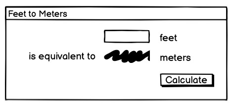
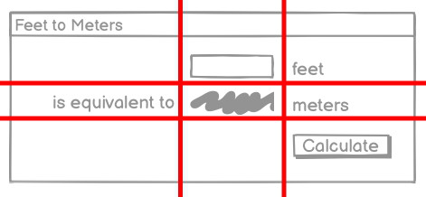

# A First (Real) Example

With that out of the way, let's try a slightly more substantial example, which
will give you an initial feel for what the code behind a real Tk program looks
like.

## Design

We'll create a simple GUI tool to convert a distance in feet to the equivalent
distance in meters. If we were to sketch this out, it might look something like
this:

| A sketch of our feet to meters conversion program |
| :-----------------------------------------------: |
|                 |

So it looks like we have a short text entry widget that will let us type in the
number of feet. A "Calculate" button will get the value out of that entry,
perform the calculation, and put the result in a label below the entry. We've
also got three static labels ("feet," "is equivalent to," and "meters"), which
help our user figure out how to work the application.

The next thing we need to do is look at the layout. The widgets that we've
included seem to be naturally divided into a grid with three columns and three
rows. In terms of layout, things seem to naturally divide into three columns and
three rows, as illustrated below:

| The layout of our user interface, which follows a 3 x 3 grid |
| :----------------------------------------------------------: |
|                                |

## Code

```rust,no_run
// cargo run --example a_first_real_example

use tcl::*;
use tk::*;
use tk::cmd::*;

fn main() -> TkResult<()> {
    let tk = make_tk!()?;
    let root = tk.root();
    root.set_wm_title( "Feet to Meters" )?;

    let c = root.add_ttk_frame( "c" -padding(( 3,3,12,12 )))?
        .grid( -column(0) -row(0) -sticky("nwes") )?;

    root.grid_columnconfigure( 0, -weight(1) )?;
    root.grid_rowconfigure( 0, -weight(1) )?;

    let feet = c.add_ttk_entry( "feet" -width(7) -textvariable("feet") )?
        .grid( -column(2) -row(1) -sticky("we") )?;

    c.add_ttk_label( "meters" -textvariable("meters") )?
        .grid( -column(2) -row(2) -sticky("we") )?;

    c.add_ttk_button( "calc" -text("Calculate") -command("calculate") )?
        .grid( -column(3) -row(3) -sticky("w") )?;

    c.add_ttk_label( "flbl" -text("feet") )?
        .grid( -column(3) -row(1) -sticky("w") )?;

    c.add_ttk_label( "islbl" -text("is equivalent to") )?
        .grid( -column(1) -row(2) -sticky("e") )?;

    c.add_ttk_label( "mlbl" -text("meters") )?
        .grid( -column(3) -row(2) -sticky("w") )?;

    c.winfo_children()?
        .iter()
        .try_for_each( |child| child.grid_configure( -padx(5) -pady(5) ))?;

    feet.focus()?;

    #[proc]
    fn calculate() -> TkResult<()> {
        let interp = tcl_interp!();
        let feet = interp.get_double("feet");
        match feet {
            Ok( feet ) => {
                let meters = f64::floor( feet * 0.3048 * 10000.0 ) / 10000.0;
                interp.set_double( "meters", meters )
            },
            Err( _ ) => interp.set( "meters", "" ),
        };
        Ok(())
    }

    // it's safe because `fn calculate()` is tagged with `#[proc]`.
    unsafe{ tk.def_proc( "calculate", calculate ); }

    root.bind_more( event::key_press( TkKey::Return ), "calculate" )?;

    Ok( main_loop() )
}
```
