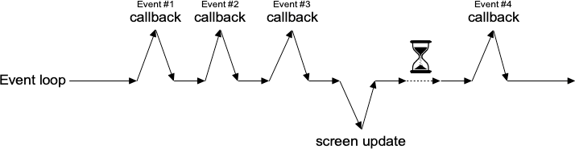
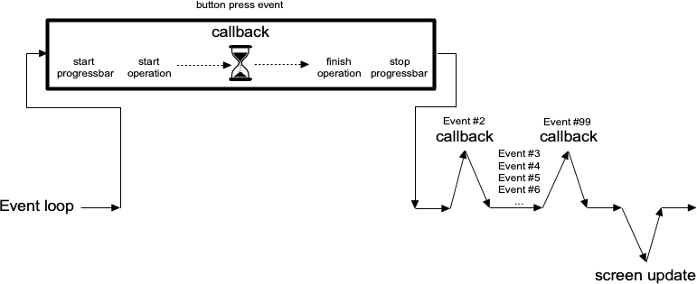

# Blocking the Event Loop

Where you run into problems is when the event loop is prevented from processing
events for a lengthy period of time. Your application won't redraw or respond to
events and will appear to be frozen. The event loop is said to be blocked. How
can this happen?

Let's start by visualizing the event loop as an execution timeline. In a normal
situation, each deviation from the event loop (callback, screen update) takes
only a fraction of a second before returning control to the event loop.

|                 Execution timeline for well-behaved event loop                 |
| :----------------------------------------------------------------------------: |
|  |

In our scenario, the whole thing probably got started from an event like a user
pressing a button. So the event loop calls our application code to handle the
event. Our code creates the progressbar, performs the (lengthy) operations, and
stops the progressbar. Only then does our code return control back to the event
loop. No events have been processed in the meantime. No screen redrawing has
occurred. They've just been piling up in the event queue.

|                 Lengthy callback blocking the event loop                 |
| :----------------------------------------------------------------------: |
|  |

To prevent blocking the event loop, it's essential that event handlers execute
quickly and return control back to the event loop.

If you do have a long-running operation to perform, or anything like network I/O
that could potentially take a long time, there are a few different approaches
you can take.

> For the more technically-inclined, Tk uses a single-threaded, event-driven
programming model. All the GUI code, the event loop, and your application run
within the same thread. Because of this, any calls or computations that block
event handlers are highly discouraged. Some other GUI toolkits use different
models that allow for blocking code, runs the GUI and event handlers in separate
threads from application code, etc. Attempting to shoehorn these models into Tk
can be a recipe for frustration and lead to fragile and hacky code. If you
respect Tk's model rather than try to fight with it, you won't run into
problems. 
