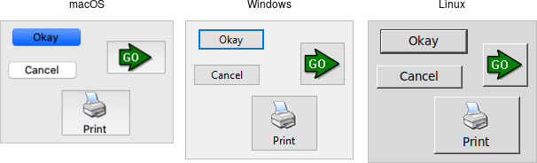

# Button

A *button*, unlike a frame or label, is very much there to interact with. Users
press a button to perform an action. Like labels, they can display text or
images, but accept additional options to change their behavior.

|                 Button widgets                |
| :-------------------------------------------: |
|  |

Buttons are created using the `add_ttk_button` method. Typically, their contents
and command callback are specified at the same time:

```rust,no_run
parent.add_ttk_button( "button" -text("Okay") -command("submitForm") )?;
```

Typically, their contents and command callback are specified at the same time.
As with other widgets, buttons can take several different configuration options,
including the standard `style` option, which can alter their appearance and
behavior.

## Text or Image

Buttons take the same `text`, `textvariable` (rarely used), `image`, and
`compound` configuration options as labels. These control whether the button
displays text and/or an image.

Buttons have a `default` configuration option. If specified as `active`, this
tells Tk that the button is the default button in the user interface; otherwise
it is `normal`. Default buttons are invoked if users hit the Return or Enter
key). Some platforms and styles will draw this default button with a different
border or highlight. Note that setting this option doesn't create an event
binding that will make the Return or Enter key activate the button; that you
have to do yourself.

## The Command Callback

The `command` option connects the button's action and your application. When a
user presses the button, the script provided by the option is evaluated by the
interpreter.

You can also ask the button to invoke the command callback from your
application. That way, you don't need to repeat the command to be invoked
several times in your program. If you change the command attached to the button,
you don't need to change it elsewhere too. Sounds like a useful way to add that
event binding on our default button, doesn't it?

```rust,no_run
let button = parent
    .add_ttk_button( "action" -text("Action") -default("active") -command("myaction") )?
    .pack(())?;

parent.bind(
    event::key_press( TkKey::Return ),
    tclosure!( tk, move || -> InterpResult<Obj> { button.invoke() })
)?;
```

> Standard behavior for dialog boxes and many other windows on most platforms is
to set up a binding on the window for the Return key
(`event::key_press( TkKey::Return )`, to invoke the active button if it exists,
as we've done here. If there is a "Close" or "Cancel" button, create a binding
to the Escape key (`event::key_press( TkKey::Escape )`). On macOS, you should
additionally bind the Enter key on the keyboard
(`event::key_press( TkKey::Enter )`) to the active button, and Command-period
(`event::command().key_press( TkKey::period )`) to the close or cancel button.

## Button State

Buttons and many other widgets start off in a normal state. A button will
respond to mouse movements, can be pressed, and will invoke its command
callback. Buttons can also be put into a disabled state, where the button is
greyed out, does not respond to mouse movements, and cannot be pressed. Your
program would disable the button when its command is not applicable at a given
point in time.

All themed widgets maintain an internal state, represented as a series of binary
flags. Each flag can either be set (on) or cleared (off). You can set or clear
these different flags, and check the current setting using the `state` and
`instate` methods. Buttons make use of the `disabled` flag to control whether or
not users can press the button. For example:

```rust,no_run
b.set_state(    TtkState::Disabled )?; // set the disabled flag
b.set_state(   !TtkState::Disabled )?; // clear the disabled flag
b.instate(      TtkState::Disabled )?; // 1 if disabled, else 0
b.instate(     !TtkState::Disabled )?; // 1 if not disabled, else 0
b.instate_run( !TtkState::Disabled,
                        "myaction" )?; // execute 'myaction' if not disabled
```

## Run Example

`cargo run --example button`
