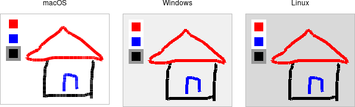

# Canvas

A *canvas* widget manages a 2D collection of graphical objects — lines, circles,
text, images, other widgets, and more. Tk's canvas is an incredibly powerful and
flexible widget and truly one of Tk's highlights. It is suitable for a wide
range of uses, including drawing or diagramming, CAD tools, displaying or
monitoring simulations or actual equipment, and building more complex widgets
out of simpler ones.

Note: Canvas widgets are part of the classic Tk widgets, not the themed Tk
widgets.

|                Canvas widgets                 |
| :-------------------------------------------: |
|  |

Canvas widgets are created using the `canvas` command:

```rust,no_run
parent.add_canvas( "canvas" -width(500) -height(400) -background("gray75") )?;
```

You'll often provide a width and height, either in pixels or any of the other
standard distance units. As always, you can ask the geometry manager to expand
it to fill the available space in the window. You might provide a default
background color for the canvas, specifying colors as you learned about in the
last chapter. Canvas widgets also support other appearance options like `relief`
and `borderwidth` that we've used before.

Canvas widgets have a tremendous number of features, and we won't cover
everything here. Instead, we'll start with a simple example, a freehand
sketching tool, and incrementally add new pieces, each showing another feature
of canvas widgets.
