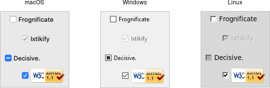

# Checkbutton

A *checkbutton* widget is like a regular button that also holds a binary value
of some kind (i.e., a toggle). When pressed, a checkbutton flips the toggle and
then invokes its callback. Checkbutton widgets are frequently used to allow
users to turn an option on or off.

|                   Checkbutton widgets                   |
| :-----------------------------------------------------: |
|  |

Checkbuttons are created using the `add_ttk_checkbutton` method. Typically,
their contents and behavior are specified at the same time:

```rust,no_run
parent.add_ttk_checkbutton( "check" -text("Use Metric") -command( "metricChanged" )
    -variable("measuresystem") -onvalue("metric") -offvalue("imperial") )?;
```

Checkbuttons use many of the same options as regular buttons but add a few more.
The `text`, `textvariable`, `image`, and `compound` configuration options
control the display of the label (next to the checkbox itself). Similarly, the
`command` option lets you specify a command to be called every time a user
toggles the checkbutton; and the `invoke` method will also execute the same
command. The `state` and `instate` methods allow you to manipulate the
`disabled` state flag to enable or disable the checkbutton. 

## Widget Value

Unlike regular buttons, checkbuttons also hold a value. We've seen before how
the `textvariable` option can link the label of a widget to a variable in your
program. The `variable` option for checkbuttons behaves similarly, except it
links a variable to current value of the widget. The variable is updated
whenever the widget is toggled. By default, checkbuttons use a value of 1 when
the widget is checked, and 0 when not checked. These can be changed to something
else using the `onvalue` and `offvalue` options.

A checkbutton doesn't automatically set (or create) the linked variable.
Therefore, your program needs to initialize it to the appropriate starting
value.

What happens when the linked variable contains neither the `onvalue` or the
`offvalue` (or even doesn't exist)? In that case, the checkbutton is put into a
special "tristate" or indeterminate mode. When in this mode, the checkbox might
display a single dash, instead of being empty or holding a checkmark.
Internally, the state flag `alternate` is set, which you can inspect via the
`instate` method:

```rust,no_run
check.instate( TtkState::Alternate )?;
```

## Run Example

`cargo run --example checkbutton`
