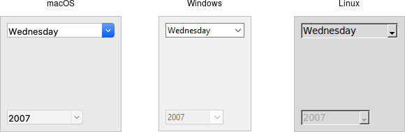

# Combobox

A *combobox* widget combines an entry with a list of choices. This lets users
either choose from a set of values you've provided (e.g., typical settings), but
also put in their own value (e.g., for less common cases).

|                 Combobox widgets                  |
| :-----------------------------------------------: |
|  |

Comboboxes are created using the `ttk_combobox` command:

```rust,no_run
parent.add_ttk_combobox( "country" -textvariable("country") )?;
```

Like entries, the `textvariable` option links a variable in your program to the
current value of the combobox. As with other widgets, you should initialize the
linked variable in your own code.

A combobox will generate a `event::virtual_event( "ComboboxSelected" )` that you
can bind to whenever its value changes. (You could also trace changes on the
`textvariable`, as we've seen in the previous few widgets we covered. Binding to
the event is more straightforward, and so tends to be our preferred choice.)

```rust,no_run
country.bind( event::virtual_event( "ComboboxSelected" ), script )?;
```

## Predefined Values

You can provide a list of values that users can choose from using the `values`
configuration option:

```rust,no_run
country.configure( -values([ "USA","Canada","Australia" ].as_slice() ))?;
```

If set, the `TtkState::ReadOnly` state flag will restrict users to making
choices only from the list of predefined values, but not be able to enter their
own (though if the current value of the combobox is not in the list, it won't be
changed).

```rust,no_run
country.set_state( TtkState::ReadOnly )?;
```

> If you're using the combobox in `TtkState::ReadOnly` mode, I'd recommend that
when the value changes (i.e., on a `event::virtual_event("ComboboxSelected")`),
that you call the `selection_clear` method. It looks a bit odd visually without
doing that.

You can also get the current value using the `get` method, and change the
current value using the `set` method (which takes a single argument, the new
value).

As a complement to the `get` and `set` methods, you can also use the `current`
method to determine which item in the predefined values list is selected. Call
`current` with no arguments; it will return a 0-based index into the list, or -1
if the current value is not in the list. You can select an item in the list by
calling `current` with a single 0-based index argument.

> Want to associate some other value with each item in the list so that your
program can use one value internally, but it gets displayed in the combobox as
something else? You'll want to have a look at the section entitled "Keeping
Extra Item Data" when we get to the discussion of listboxes in a couple of
chapters from now.

## Run Example

`cargo run --example combobox`
