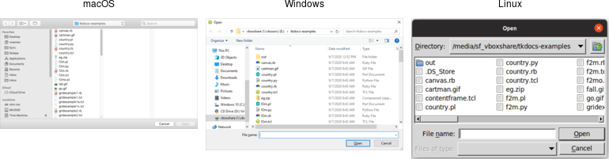
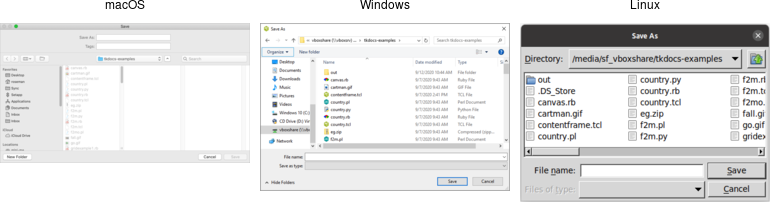
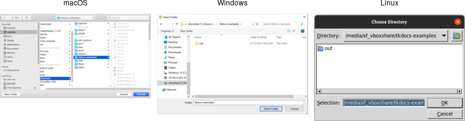
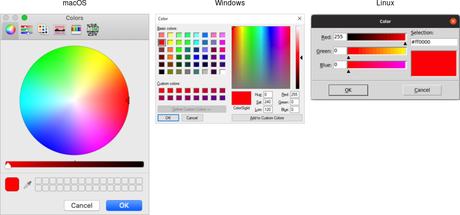
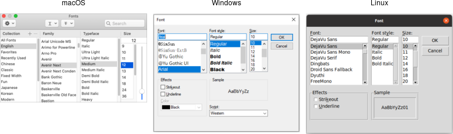
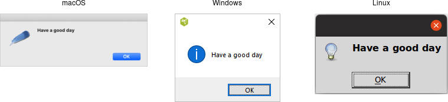
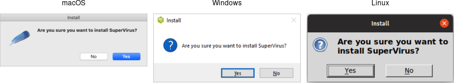

# Dialog Windows

Dialog boxes are a type of window used in applications to get some information
from users, inform them that some event has occurred, confirm an action, and
more. The appearance and usage of dialog boxes are usually quite specifically
detailed in a platform's style guide. Tk comes with several dialog boxes
built-in for common tasks. These help you conform to platform-specific style
guidelines.

## Selecting Files and Directories

Tk provides several dialogs to let users select files or directories. On Windows
and macOS, these invoke the underlying operating system dialogs directly. The
"open" variant on the dialog is used when you want users to select an existing
file (like in a `"File | Open..."` menu command), while the "save" variant is
used to choose a file to save into (usually used by the `"File | Save As..."`
menu command).

```rust,no_run
let filename = tk.get_open_file()?;
let filename = tk.get_save_file()?;
let dirname  = tk.choose_directory()?;
```

All of these commands produce modal dialogs. This means that the commands will
not complete until a user submits the dialog. These commands return the full
pathname of the file or directory a user has chosen, or an empty string if a
user cancels out of the dialog.

|                  Open file dialogs                  |
| :-------------------------------------------------: |
|  |

|                  Save file dialogs                  |
| :-------------------------------------------------: |
|  |

|                 Choose directory dialogs                 |
| :------------------------------------------------------: |
|  |

Various options can be passed to these dialogs, allowing you to set the
allowable file types, initial directory, default filename, and many more. These
are detailed in the `getOpenFile` (includes `getSaveFile`) and `chooseDirectory`
reference manual pages.

### Selecting Colors

Another modal dialog lets users select a color. It will return a color value,
e.g. `#ff62b8`. The dialog takes an optional `initialcolor` option to specify an
existing color, i.e., that users might want to replace. More information is
available in the `chooseColor` reference manual pages.

```rust,no_run
tk.choose_color( -initialcolor("#ff0000") )?;
```

|                  Choose color dialogs                  |
| :----------------------------------------------------: |
|  |

## Selecting Fonts

Tk 8.6 added support for another system dialog: a font chooser. While the file
dialogs and color chooser were modal dialogs, that block until the dialog is
dismissed and then return a result, the font chooser doesn't work like that.

|                  Font chooser dialogs                  |
| :----------------------------------------------------: |
|  |

While the system font dialog is modal on some platforms, e.g., Windows, that's
not the case everywhere. On macOS, the system font chooser works more like a
floating tool palette in a drawing program, remaining available to change the
font for whatever text is selected in your main application window. The Tk font
dialog API has to accommodate both models. To do so, it uses callbacks (and
virtual events) to notify your application of font changes.

To use the font dialog, first provide it with an initial font and a callback
which will be invoked when a font is chosen. For illustration, we'll have the
callback change the font on a label.

```rust,no_run
let l = root
    .add_ttk_label( "l" -text("Hello World") -font("helvetica 24") )?
    .grid( -padx(10) -pady(10) )?;
tclosure!( tk, cmd:"font_changed",
    move |some_font:Obj| -> TkResult<()> { Ok( l.configure( -font(some_font) )? )});
tk.fontchooser_configure( -font("helvetica 24") -command("font_changed") )?;
```

> You can query or change the font that is (or will be) displayed in the dialog
at any time.

Next, put the dialog onscreen via the `show` method. On platforms where the font
dialog is modal, your program will block at this point until the dialog is
dismissed. On other platforms, `show` returns immediately; the dialog remains
onscreen while your program continues. At this point, a font has not been
chosen. There's also a `hide` method to remove it from the screen (not terribly
useful when the font dialog is modal).

```rust,no_run
tk.fontchooser_show()?;
tk.fontchooser_hide()?;
```

If the font dialog was modal, and the user chose a font, the dialog would have
invoked your callback, passing it a font specification. If they cancelled out of
the dialog, there'd be no callback. When the dialog isn't modal, and the user
chooses a font, it will invoke your callback. A
`event::virtual_event( "TkFontchooserFontChanged" )` virtual event is also
generated; you can retrieve the current font via the dialog's `font`
configuration option. If the font dialog is closed, a
`event::virtual_event( "TkFontchooserVisibility" )` is generated. You can also
find out if the font dialog is currently visible onscreen via the `visible`
configuration option (though changing it is an error; use the `show` and `hide`
methods instead).

> Because of the significant differences between them, providing a good user
  experience on all platforms takes a bit of work. On platforms where the font
  dialog is modal,it's likely to be invoked from a button or menu item that
  says, e.g., `Font...`. On other platforms, the button or menu item should
  toggle between `Show Fonts` and `Hide Fonts`.

> If you have several text widgets in your application that can be given
  different fonts, when one of them gains focus, it should update the font
  chooser with its current font. This also means that a callback from the font
  dialog may apply to a different text widget than the one you initially called
  `show` from! Finally, be aware that the font chooser itself may gain the
  keyboard focus on some platforms. 

> As of Tk 8.6.10, there are a few bugs in the font chooser on various
  platforms. Here's a quick rundown including workarounds: 

> - on macOS, if you don't provide a font via the `font` configuration option,
  your callbacks won't be invoked ⇒ always provide an initial font

> - on X11, if you don't provide values for all configuration options, those you
  don't include will be reset to their default values ⇒ whenever you change any
  option, change all of them, even if it's just to their current value

> - on X11, the font dialog includes an `Apply` button when you provide a
  callback, but omits it when you don't (and just watch for virtual events);
  however, other bugs mean those virtual events are never generated ⇒ always
  provide a command callback

> - on Windows, you can also leave off the `Apply` button by not providing a
  callback; while virtual events are generated on font changes, the `font`
  configuration option is never updated ⇒ always provide a command callback, and
  hold onto the font yourself, rather than trying to ask the font dialog for it
  later

> - on Windows, a font change virtual event is not generated if you change the
  `font` configuration option in your code, though it is on macOS and X11 ⇒ take
  any necessary actions when you change the font in your code rather than in a
  virtual event handler 

> Because of the differences between platforms and the various bugs, testing is
  far more important when using the font chooser than the other system dialogs.

### Alert and Confirmation Dialogs

Many applications use various simple modal alerts or dialogs to notify users of
an event, ask them to confirm an action, or make another similar choice via
clicking on a button. Tk provides a versatile "message box" that encapsulates
all these different types of dialogs.

```rust,no_run
tk.message_box( -message("Have a good day") )?;
```

|             Simple message boxes                 |
| :----------------------------------------------: |
|  |

```rust,no_run
tk.message_box(
    -type_( "yesno" )
    -message( "Are you sure you want to install SuperVirus?" )
    -icon( "question" ) -title( "Install" )
)?;
```

|                 Example message boxes                  |
| :----------------------------------------------------: |
|  |

Like the previous dialogs that we've seen, these are modal and return the result
of a user's action to the caller. The exact return value will depend on the
`type_` option passed to the command, as shown here:

`ok (default)`:       ⇒ `ok`
`okcancel`:           ⇒ `ok` or `cancel`
`yesno`:              ⇒ `yes` or `no`
`yesnocancel`:        ⇒ `yes`, `no` or `cancel`
`retrycancel`:        ⇒ `retry` or `cancel`
`abortretryignore`:   ⇒ `abort`, `retry` or `ignore` 

The full list of possible options is shown here:

`type_`:    As described above.
`message`:  The main message displayed inside the alert.
`detail`:   A secondary message (if needed).
`title`:    Title for the dialog window. Not used on macOS.
`icon`:     Icon, one of info (default), error, question or warning.
`default`:  Default button, e.g. ok or cancel for a okcancel dialog.
`parent`:   Window of your application this dialog is being posted for.

Additional details can be found in the reference manual.

## Run Example

`cargo run --example dialog_windows`
