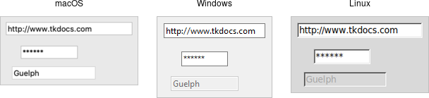

# Entry

An *entry* widget presents users with a single line text field where they can
type in a string value. These can be just about anything: a name, a city, a
password, social security number, etc.

|                Entry widgets                |
| :-----------------------------------------: |
|  |

Entries are created using the `add_ttk_entry` method:

```rust,no_run
parent.add_ttk_entry( "name" -textvariable("username") )?;
```

A `width` configuration option may be specified to provide the number of
characters wide the entry should be. This allows you, for example, to display a
shorter entry for a zip or postal code.

## Entry Contents

We've seen how checkbutton and radiobutton widgets have a value associated with
them. Entries do as well, and that value is usually accessed through a linked
variable specified by the `textvariable` configuration option. 

> Unlike the various buttons, entries don't have a text or image beside them to
identify them. Use a separate label widget for that.

You can also get or change the value of the entry widget without going through
the linked variable. The `get` method returns the current value, and the
`delete` and `insert` methods let you change the contents, e.g.

```rust,no_run
println!( "current value is {}", name.get() );
name.delete_range( 0.. )?; // delete between two indices, 0-based
name.insert( 0, "your name" )?; // insert new text at a given index
```

## Watching for Changes

Entry widgets don't have a `command` option to invoke a callback whenever the
entry is changed. To watch for changes, you should watch for changes to the
linked variable. See also "Validation", below.

```rust,no_run
#[proc] fn it_has_been_written() -> TkResult<()> { Ok(()) }
interpreter.trace_add_variable_write( "username", "it_has_been_written" )?;
```

You'll be fine if you stick with simple uses of `trace_add_variable_write` like
that shown above. You might want to know that this is a small part of a much
more complex system for observing variables and invoking callbacks when they are
read, written, or deleted. You can trigger multiple callbacks, add or delete
them (`trace_remove_variable_write`), and introspect them
(`trace_info_variable`).

## Passwords

Entries can be used for passwords, where the actual contents are displayed as a
bullet or other symbol. To do this, set the `show` configuration option to the
character you'd like to display.

```rust,no_run
parent.add_ttk_entry( "passwd" -textvariable("password") -show("*") )?;
```

## Widget States

Like the various buttons, entries can also be put into a disabled state via the
`state` command (and queried with `instate`). Entries can also use the state
flag `readonly`; if set, users cannot change the entry, though they can still
select the text in it (and copy it to the clipboard). There is also an `invalid`
state, set if the entry widget fails validation, which leads us to...

## Validation

Users can type any text they like into an entry widget. However, if you'd like
to restrict what they can type into the entry, you can do so with validation.
For example, an entry might only accept an integer or a valid zip or postal
code.

Your program can specify what makes an entry valid or invalid, as well as when
to check its validity. As we'll see soon, the two are related. We'll start with
a simple example, an entry that can only hold an integer up to five digits long.

The validation criteria is specified via an entry's `validatecommand`
configuration option. You supply a piece of code whose job is to validate the
entry. It functions like a widget callback or event binding, except that it
returns a value (whether or not the entry is valid). We'll arrange to validate
the entry on any keystroke, which is specified by providing a value of `key` to
the `validate` configuration option.

```rust,no_run
let validate_cmd = tclfn!( &tk, args: "%P",
    fn check_num( new_val: String ) -> TclResult<bool> {
       Ok( new_val.len() <= 5 &&
           new_val.chars().filter( |&ch| ch >= '0' && ch <= '9' ).count() <= 5 )
    }
);

root.add_ttk_entry( "e" -textvariable("num") -validate("key") -validatecommand(validate_cmd) )?
    .grid( -column(0) -row(2) -sticky("we") )?;
```

A few things are worth noting. First, as with event bindings, we can access more
information about the conditions that triggered the validation via percent
substitutions. We used one of these here: `%P  is the new value of the entry if
the validation passes. We'll use a simple regular expression and a length check
to determine if the change is valid. To reject the change, our validation
command can return a false value, and the entry will remain unchanged.

Let's extend our example so that the entry will accept a US zip code, formatted
as "#####" or "#####-####" ("#" can be any digit). We'll still do some
validation on each keystroke (only allowing entry of numbers or a hyphen).
However, We can no longer fully validate the entry on every keystroke; if
they've just typed the first digit, it's not valid yet. So full validation will
only happen when the entry loses focus (e.g., a user tabs away from it). Tk
refers to this as revalidation, in contrast with prevalidation (accepting
changes on each keystroke).

How should we respond to errors? Let's add a message reminding users of the
format. It will appear if they type a wrong key or tab away from the entry when
it's not holding a valid zip code. We'll remove the message when they return to
the entry or type a valid key. We'll also add a (dummy) button to "process" the
zip code, which will be disabled unless the zip entry is valid. Finally, we'll
also add a "name" entry so you can tab away from the zip entry.

```rust,no_run
const FORMATMSG: &'static str = "Zip should be ##### or #####-####";

let f = root.add_ttk_frame( "f" )?
    .grid( -column(0) -row(3) )?;

f.add_ttk_label( "l1" -text("Name:") )?
    .grid( -column(0) -row(4) -padx(5) -pady(5) )?;

let _e1 = f.add_ttk_entry( "e1" )?
    .grid( -column(1) -row(4) -padx(5) -pady(5) )?;

f.add_ttk_label( "l" -text("Zip:") )?
    .grid( -column(0) -row(5) -padx(5) -pady(5) )?;

let f_btn = f.add_ttk_button( "btn" -text("Process") )?
    .grid( -column(2) -row(5) -padx(5) -pady(5) )?;

f_btn.set_state( TtkState::Disabled )?;

let check_zip_cmd = tkbind!( tk, cmd: "check_zip", args: "%P %V",
    move |new_val: String, op: String| -> TkResult<bool> {
        let interp = tcl_interp!();
        interp.set( "errmsg", "" );

        let re = r#"^[0-9]{5}(\-[0-9]{4})?$"#;
        let regex = Regex::new( re ).unwrap();
        let valid = regex.is_match( &new_val );
        f_btn.set_state( if valid{ !TtkState::Disabled } else{ TtkState::Disabled })?;
        if op == "key" {
            let regex = Regex::new( r#"^[0-9\-]*$"# ).unwrap();
            let ok_so_far = regex.is_match( &new_val ) && new_val.len() <= 10;
            if !ok_so_far {
                interp.set( "errmsg", FORMATMSG );
            }
            return Ok( true );
        } else if op == "focusout" {
            if !valid {
                interp.set( "errmsg", FORMATMSG );
            }
        }
        if valid {
            Ok( true )
        } else {
            Ok( false )
        }
    }
);

f.add_ttk_entry( "e" -textvariable("zip") -validate("all") -validatecommand(check_zip_cmd) )?
    .grid( -column(1) -row(5) -padx(5) -pady(5) )?;

f.add_ttk_label( "msg" -font("TkSmallCaptionFont") -foreground("red") -textvariable("errmsg") )?
    .grid( -column(1) -row(2) -padx(5) -pady(5) -sticky("w") )?;
```

Notice that the `validate` configuration option has been changed from `key` to
`all`. That arranges for the `validatecommand` callback to be invoked on not
only keystrokes but other triggers. The trigger is passed to the callback using
the %V percent substitution. The callback differentiated between `key` and
`focusout` triggers (you can also check for `focusin`).

> There's a few more things to know about validation. First, if your
`validatecommand` ever generates an error (or doesn't return a boolean),
validation will be disabled for that widget. Your callback can modify the entry,
e.g., change its textvariable. You can ask the widget to validate at any time by
calling it's `validate` method, which returns true if validation passes (the
`%V` substitution is set to `forced`).

> There is an `invalidcommand` configuration option (which works like
`validatecommand`) that is called whenever validation fails. You can use it to
accomplish nasty things like forcing the focus back on the widget that didn't
validate. In practice, it's rarely used. As mentioned earlier, the entry's
`invalid` state flag (which can be checked via the `instate` `invalid` method)
is automatically updated as validation succeeds or fails.

> Other percent substitutions allow you to get the entry's contents prior to
editing (`%s`), differentiate between insert and delete (`%d`), where an insert
or delete occurs (`%i`), what is being inserted or deleted (`%S`), the current
setting of the `validate` option (`%v`) and the name of the widget (`%W`).

## Run Example

`cargo run --example entry`
