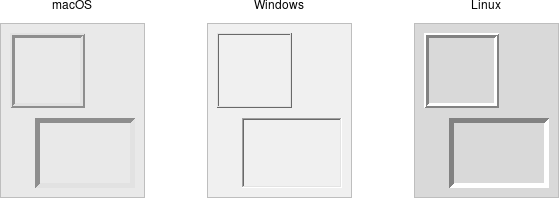

# Frame

A *frame* is a widget that displays as a simple rectangle. Frames help to
organize your user interface, often both visually and at the coding level.
Frames often act as master widgets for a geometry manager like `grid`, which
manages the slave widgets contained within the frame.

|                Frame widgets                |
| :-----------------------------------------: |
|  |

Frames are created using the `add_ttk_frame()` method:

```rust,no_run
let f = root.add_ttk_frame( "frame" )?;
```

Frames can take several different configuration options, which can alter how
they are displayed.

## Requested Size

Typically, the size of a frame is determined by the size and layout of any
widgets within it. In turn, this is controlled by the geometry manager that
manages the contents of the frame itself.

If, for some reason, you want an empty frame that does not contain other
widgets, you can instead explicitly set its size using the width and/or height
configuration options (otherwise, you'll end up with a very small frame indeed).

Screen distances such as width and height are usually specified as a number of
pixels screen. You can also specify them via one of several suffixes. For
example, 350 means 350 pixels, 350c means 350 centimeters, 350m means 350
millimeters, 350i means 350 inches, and 350p means 350 printer's points (1/72
inch).

> Remember, if you request that a frame (or any widget) to have a given size,
the geometry manager has the final say. If things aren't showing up the way you
want them, make sure to check there too.

## Padding

The padding configuration option is used to request extra space around the
inside of the widget. If you're putting other widgets inside the frame, there
will be a bit of a margin all the way around. You can specify the same padding
for all sides, different horizontal and vertical padding, or padding for each
side separately.

```rust,no_run
// 5 pixels on all sides
frame.configure( -padding( 5 ))?;

// 5 on left and right, 10 on top and bottom
frame.configure( -padding(( 5, 10 )))?;

// left: 5, top: 7, right: 10, bottom: 12
frame.configure( -padding(( 5, 7, 10, 12 )))?;
```

## Borders

You can display a border around a frame widget to visually separate it from its
surroundings. You'll see this often used to make a part of the user interface
look sunken or raised. To do this, you need to set the borderwidth configuration
option (which defaults to 0, i.e., no border), and the relief option, which
specifies the visual appearance of the border. This can be one of: flat
(default), raised, sunken, solid, ridge, or groove.

```rust,no_run
frame.configure( -borderwidth(2) -relief("sunken") )?;
```

## Changing Styles

Frames have a style configuration option, which is common to all of the themed
widgets. This lets you control many other aspects of their appearance or
behavior. This is a bit more advanced, so we won't go into it in too much detail
right now. But here's a quick example of creating a "Danger" frame with a red
background and a raised border.

```rust,no_run
let danger = tk.new_ttk_style( "Danger.TFrame", None );
danger.configure( -background("red") -borderwidth(5) -relief("raised") )?;

let frame = root
    .add_ttk_frame( "frame" -width(200) -height(200) -style(&danger) )?
    .grid(())?;
```

> What elements of widgets can be changed by styles vary by widget and platform.
On Windows and Linux, it does what you'd expect. On current macOS, the frame
will have a red raised border, but the background will remain the default grey.
Much more on why this is in a later chapter.

> Styles mark a sharp departure from how most aspects of a widget's visual
appearance were changed in the "classic" Tk widgets. In classic Tk, you could
provide a wide range of options to finely control every aspect of an individual
widget's behavior, e.g., foreground color, background color, font, highlight
thickness, selected foreground color, and padding. When using the new themed
widgets, these changes are made by modifying styles, not adding options to each
widget.
As such, many options you may be familiar with in certain classic widgets are
not present in their themed version. However, overuse of such options was a key
factor undermining the appearance of Tk applications, especially when used
across different platforms. Transitioning from classic to themed widgets
provides an opportune time to review and refine how (and if!) such appearance
changes are made.

## Run Example

`cargo run --example frame`
