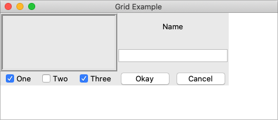
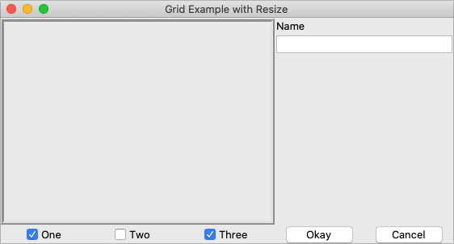

# Handling Resize

If you've tried to resize the example, you'll notice that nothing moves at all,
as shown below.

|                 Resizing the window                |
| :------------------------------------------------: |
|  |

Even if you took a peek below and added the extra `sticky` options to our
example, you'd still see the same thing. It looks like `sticky` may tell Tk how
to react if the cell's row or column does resize, but doesn't actually say that
the row or columns should resize if extra room becomes available. Let's fix
that.

Every column and row in the grid has a `weight` option associated with it. This
tells `grid` how much the column or row should grow if there is extra room in
the master to fill. By default, the weight of each column or row is 0, meaning
it won't expand to fill any extra space.

For the user interface to resize then, we'll need to specify a positive weight
to the columns and rows that we'd like to expand. You must provide weights for
at least one column and one row. This is done using the `columnconfigure` and
`rowconfigure` methods of `grid`. This weight is relative. If two columns have
the same weight, they'll expand at the same rate. In our example, we'll give the
three leftmost columns (holding the checkbuttons) a weight of 3, and the two
rightmost columns a weight of 1. For every one pixel the right columns grow, the
left columns will grow by three pixels. So as the window grows larger, most of
the extra space will go to the left side.

|                Resizing the window after adding weights               |
| :-------------------------------------------------------------------: |
|  |

Both `columnconfigure` and `rowconfigure` also take a `minsize` grid option,
which specifies a minimum size which you really don't want the column or row to
shrink beyond.
