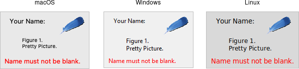

# Label

A *label* is a widget that displays text or images, typically that users will
just view but not otherwise interact with. Labels are used for to identify
controls or other parts of the user interface, provide textual feedback or
results, etc.

|                Frame widgets                |
| :-----------------------------------------: |
|  |

Labels are created using the `add_ttk_label()` method. Often, the text or image
the label will display are specified via configuration options at the same time:

```rust,no_run
parent.add_ttk_label( "label" -text("Full name") )?;
```

Like frames, labels can take several different configuration options, which can
alter how they are displayed.

## Displaying Text

The text configuration option (shown above when creating the label) is the most
commonly used, particularly when the label is purely decorative or explanatory.
You can change what text is displayed by modifying this configuration option.
This can be done at any time, not only when first creating the label.

You can also have the widget monitor a variable in your script. Anytime the
variable changes, the label will display the new value of the variable. This is
done with the `textvariable` option:

```rust,no_run
label.configure( -textvariable("resultContents") )?;
tk.set( "resultContents", "New value to display" );
```

Variables must be global, or the fully qualified name given for those within a
namespace.

## Displaying Images

Labels can also display an image instead of text. If you just want an image
displayed in your user interface, this is normally the way to do it. We'll go
into images in more detail in a later chapter, but for now, let's assume you
want to display a GIF stored in a file on disk. This is a two-step process.
First, you will create an image "object." Then, you can tell the label to use
that object via its `image` configuration option:

```rust,no_run
let img = image_create_photo( -file("myimage.gif") )?;
label.configure( -image(img) )?;
```

Labels can also display both an image and text at the same time. You'll often
see this in toolbar buttons. To do so, use the `compound` configuration option.
The default value is `none`, meaning display only the image if present; if there
is no image, display the `text` specified by the `text` or `textvariable`
options.  Other possible values for the `compound` option are: `text` (text
only), `image` (image only), `center` (text in the center of image), `top`
(image above text), `left`, `bottom`, and `right`.

## Fonts, Colors, and More

Like with frames, you normally don't want to change things like fonts and colors
directly. If you need to change them (e.g., to create a special type of label),
the preferred method would be to create a new style, which is then used by the
widget with the style option.

Unlike most themed widgets, the label widget also provides explicit
widget-specific configuration options as an alternative. Again, you should use
these only in special one-off cases when using a style didn't necessarily make
sense.

You can specify the font used to display the label's text using the font
configuration option. While we'll go into fonts in more detail in a later
chapter, here are the names of some predefined fonts you can use:

| name               | description                                        |
| :----------------- | :------------------------------------------------- |
| TkDefaultFont      | Default for all GUI items not otherwise specified. |
| TkTextFont         | Used for entry widgets, listboxes, etc.            |
| TkFixedFont        | A standard fixed-width font.                       |
| TkMenuFont         | The font used for menu items.                      |
| TkHeadingFont      | A font for column headings in lists and tables.    |
| TkCaptionFont      | A font for window and dialog caption bars.         |
| TkSmallCaptionFont | Smaller captions for subwindows or tool dialogs.   |
| TkIconFont         | A font for icon captions.                          |
| TkTooltipFont      | A font for tooltips.                               |

> Because font choices are so platform-specific, be careful of hardcoding
specifics (font families, sizes, etc.). This is something else you'll see in
many older Tk programs that can make them look ugly.

```rust,no_run
label.configure( -font("TkDefaultFont") )?;
```

The foreground (text) and background color of the label can also be changed via
the `foreground` and `background` configuration options. Colors are covered in
detail later, but you can specify them as either color names (e.g., `red`) or
hex RGB codes (e.g., `#ff340a`).

Labels also accept the relief configuration option discussed for frames to make
them appear sunken or raised.

## Layout

While the overall layout of the label (i.e., where it is positioned within the
user interface, and how large it is) is determined by the geometry manager,
several options can help you control how the label will be displayed within the
rectangle the geometry manager gives it.

If the box given to the label is larger than the label requires for its
contents, you can use the `anchor` option to specify what edge or corner the label
should be attached to, which would leave any empty space in the opposite edge or
corner. Possible values are specified as compass directions: `n` (north, or top
edge), `ne`, (north-east, or top right corner), `e`, `se`, `s`, `sw`, `w`, `nw`
or `center`.

> Things not appearing where you think they should? It may be that the geometry
manager is not putting the label where you think it is. For example, if you're
using `grid`, you may need to adjust the `sticky` options. When debugging, it
can help to change the background color of each widget, so you know exactly
where each is positioned. This is a good example of those "one-off" cases we
just mentioned where you might use configuration options rather than styles to
modify appearance.

## Multi-line Labels

Labels can display more than one line of text. To do so, embed carriage returns
(`\n`) in the `text` (or `textvariable`) string. Labels can also automatically
wrap your text into multiple lines via the `wraplength` option, which specifies
the maximum length of a line (in pixels, centimeters, etc.).

> Multi-line labels are a replacement for the older `message` widgets in classic
Tk.

You can also control how the text is justified via the `justify` option. It can
have the values `left`, `center`, or `right`. If you have only a single line of
text, you probably want the `anchor` option instead.

## Run Example

`cargo run --example label`
