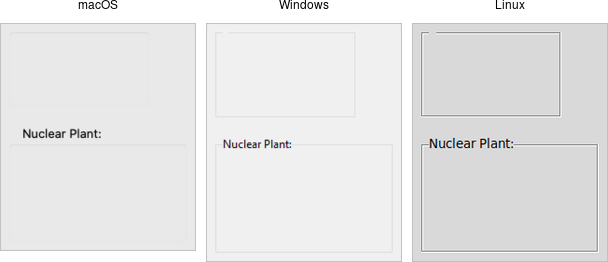

# Label Frames

A *labelframe* widget, also commonly known as a group box, provides another way
to group related components. It acts like a normal `ttk_frame`, in that it
contains other widgets that you `grid` inside it. However, it is visually set
off from the rest of the user interface. You can optionally provide a text label
to be displayed outside the labelframe.

|                  Labelframe widgets                   |
| :---------------------------------------------------: |
|  |

Labelframes are created using the `add_ttk_labelframe` method:

```rust,no_run
parent.add_ttk_labelframe( "lf" -text("Label") )?;
```
