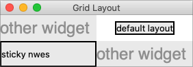

# Layout within the Cell

Because the width of a column (and height of a row) depends on all the widgets
that have been added to it, the odds are that at least some widgets will have a
smaller width or height than has been allocated for the cell its been placed in.
So the question becomes, where exactly should it be put within the cell?

By default, if a cell is larger than the widget contained in it, the widget will
be centered within it, both horizontally and vertically. The master's background
will display in the empty space around it. In the figure below, the widget in
the top right is smaller than the cell allocated to it. The (white) background
of the master fills the rest of the cell.

|                Layout within the cell and the 'sticky' option               |
| :-------------------------------------------------------------------------: |
|  |

The `sticky` option can change this default behavior. Its value is a string of
0 or more of the compass directions `nsew`, specifying which edges of the cell
the widget should be "stuck" to. For example, a value of `n` (north) will jam
the widget up against the top side, with any extra vertical space on the bottom;
the widget will still be centered horizontally. A value of `nw` (north-west)
means the widget will be stuck to the top left corner, with extra space on the
bottom and right.

Specifying two opposite edges, such as `we` (west, east) means that the widget
will be stretched. In this case, it will be stuck to both the left and right
edge of the cell. So the widget will then be wider than its "ideal" size.

If you want the widget to expand to fill up the entire cell, grid it with a
sticky value of `nsew` (north, south, east, west), meaning it will stick to
every side. This is shown in the bottom left widget in the above figure.

> Most widgets have options that can control how they are displayed if they are
larger than needed. For example, a label widget has an `anchor` option that
controls where the label's text will be positioned within the widget's
boundaries. The bottom left label in the figure above uses the default anchor
(`w`, i.e., left side, vertically centered).

> If you're having trouble getting things to line up the way you want them to,
first make sure you know how large the widget is. As we discussed with the
`label` widget in the previous chapter, changing the widget's background or
border can help.
