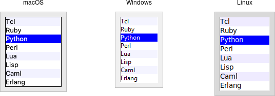
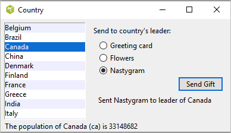

# Listbox

A *listbox* widget displays a list of single-line text items, usually lengthy,
and allows users to browse through the list, selecting one or more.

Listboxes are part of the classic Tk widgets; there is not presently a listbox
in the themed Tk widget set.

> Tk's treeview widget (which is themed) can also be used as a listbox (a one
level deep tree), allowing you to use icons and styles with the list. It's also
likely that a multi-column (table) list widget will make it into Tk at some
point, whether based on treeview or one of the available extensions.

|                 Listbox widgets                 |
| :---------------------------------------------: |
|  |

Listboxes are created using the `add_tk_listbox` method. A height configuration
option can specify the number of lines the listbox will display at a time
without scrolling:

```rust,no_run
parent.add_listbox( "l" -height(10) )?;
```

## Populating the Listbox Items

There's an easy way and a hard way to populate and manage all the items in the
listbox.

Here's the easy way. Each listbox has a `listvariable` configuration option,
which allows you to link a variable (which must hold a list) to the listbox.
Each element of this list is a string representing one item in the listbox. To
add, remove, or rearrange items in the listbox, you can simply modify this
variable as you would any other list. Similarly, to find out, e.g., which item
is on the third line of the listbox, just look at the third element of the list
variable.

The older, harder way to do things is to use a set of methods that are part of
the listbox widget itself. They operate on the (internal) list of items
maintained by the widget:

The `insert( &self, idx: impl Into<ListboxIndex>, elements )` method is used to
add one or more items to the list; `idx` is a 0-based index indicating the
position of the item before which the item(s) should be added; specify
`ListboxIndex::End` to put the new items at the end of the list.

Use the `delete( &self, index: impl Into<Index> )` or
`delete_range( &self, range: impl Into<TkRange<Index>> )` method to delete one
or more items from the list.

Use the `get( &self, index: impl Into<Index> )` method to return the contents of
a single item at the given position, or use the
`get_range( &self, range: impl Into<TkRange<Index>> )` method to get a list of
the items in the `range`.

The `size` method returns the number of items in the list.

> The reason there is a hard way at all is because the `listvariable` option was
only introduced in Tk 8.3. Before that, you were stuck with the hard way.
Because using the list variable lets you use all the standard list operations,
it provides a much simpler API. It's certainly an upgrade worth considering if
you have listboxes doing things the older way.

## Selecting Items

You can choose whether users can select only a single item at a time from the
`listbox`, or if multiple items can simultaneously be selected. This is
controlled by the `selectmode` option: the default is only being able to select
a single item (`browse`), while a `selectmode` of `extended` allows users to
select multiple items.

> The names `browse` and `extended`, again for backward compatibility reasons,
are truly awful. This is made worse by the fact that there are two other modes,
`single` and `multiple`, which you *should not use* (they use an old interaction
style that is inconsistent with modern user interface and platform conventions).

To find out which item or items in the listbox are currently selected, use the
`curselection` method. It returns a list of indices of all items currently
selected; this may be an empty list. For lists with a `selectmode` of `browse`,
it will never be longer than one item. You can also use the `selection_includes`
index method to check if the item with the given index is currently selected.

```rust,no_run
if lbox.selection_includes( 2 ) { /* omitted */ }
```

To programmatically change the selection, you can use the
`selection_clear( &self, values: impl IntoTkValues<ListboxIndex> )` method to
deselect either a single item or any within the range of indices specified. To
select an item or all items in a range, use the
`selection_set( &self, values: impl IntoTkValues<ListboxIndex> )` method. Both
of these will not touch the selection of any items outside the range specified.

If you change the selection, you should also make sure that the newly selected
item is visible (i.e., it is not scrolled out of view). To do this, use the
`see_index` method.

```rust,no_run
lbox.selection_set( idx )?;
lbox.see( idx )?;
```

When a user changes the selection, a `event::virtual_event( "ListboxSelect" )`
is generated. You can bind to this to take any action you need. Depending on
your application, you may also want to bind to a double-click
`event::double().button_press_1()` event and use it to invoke an action with the
currently selected item.

```rust,no_run
lbox.bind( event::virtual_event( "ListboxSelect" ),
    tclosure!( tk, || -> TkResult<()> {
        Ok( update_details( lbox.curselection()? ))
    }
))?;

lbox.bind( event::double().button_press_1(),
    tclosure!( tk, || -> TkResult<()> {
        Ok( invoke_action( lbox.curselection()? ))
    }
))?;
```

## Stylizing the List

Like most of the "classic" Tk widgets, you have immense flexibility in modifying
the appearance of a listbox. As described in the
[`reference manual`](https://www.tcl.tk/man/tcl/TkCmd/listbox.html), you can
modify the font the listbox items are displayed in, the foreground (text) and
background colors for items in their normal state, when selected, when the
widget is disabled, etc. There is also an `itemconfigure` method that allows you
to change the foreground and background colors of individual items.

As is often the case, restraint is useful. Generally, the default values will be
entirely suitable and a good match for platform conventions. In the example
we'll get to momentarily, we'll show how restrained use of these options can be
put to good effect, in this case displaying alternate lines of the listbox in
slightly different colors.

## Keeping Extra Item Data

The `listvariable` (or the internal list, if you're managing things the old way)
holds the strings that will be shown in the listbox. It's often the case,
though, that each string you're displaying is associated with some other data
item. This might be an internal object that is meaningful to your program, but
not meant to be displayed to users. In other words, what you're really
interested in is not so much the string displayed in the listbox, but the
associated data item. For example, a listbox may display a list of names to
users, but your program is really interested in the underlying user object (or
id number) for each one, not the particular name.

How can we associate this underlying value with the name that is displayed?
Unfortunately, the listbox widget itself doesn't offer any facilities, so it's
something we'll have to manage separately. There are a couple of obvious
approaches. First, if the displayed strings are guaranteed unique, you could use
a hash table to map each name to its associated underlying object. This wouldn't
work well for peoples' names, where duplicates are possible, but could work for
countries, which are unique.

A second approach is to keep a second list, parallel to the list of strings
displayed in the listbox. This second list will hold the underlying object
associated with each item that is displayed. So the first item in the displayed
strings list corresponds to the first item in the underlying objects list, the
second to the second, etc. Any changes that you make in one list (insert,
delete, reorder), you must make in the other. You can then easily map from the
displayed list item to the underlying object, based on their position in the
list.

## Example

Here is a silly example showing several of these listbox techniques. We'll have
a list of countries displayed. We'll be able to select only a single country at
a time. As we do so, a status bar will display the population of the country.
You can press a button to send one of several gifts to the selected country's
head of state (well, not really, but use your imagination). Sending a gift can
also be triggered by double-clicking the list or hitting the Return key.

Behind the scenes, we maintain two lists in parallel. The first is a list of
two-letter country codes. The other is the corresponding name for each country
that we will display in the listbox. We also have a simple hash table that
contains the population of each country, indexed by the two-letter country code.

|               Country selector listbox example               |
| :----------------------------------------------------------: |
|  |

```rust,no_run
// cargo run --example listbox

use std::collections::HashMap;

use tcl::*;
use tk::*;
use tk::cmd::*;

fn main() -> TkResult<()> {
    let tk = make_tk!()?;
    let root = tk.root();

    // Initialize our country "databases":
    //  - the list of country codes (a subset anyway)
    //  - parallel list of country names, same order as the country codes
    //  - a hash table mapping country code to population
    tk.set( "countrycodes", vec![
        "ar", "au", "be", "br", "ca", "cn", "dk", "fi", "fr", "gr",
        "in", "it", "jp", "mx", "nl", "no", "es", "se", "ch" ]);

    tk.set( "countrynames", vec![
        "Argentina", "Australia", "Belgium", "Brazil", "Canada", "China",
        "Denmark", "Finland", "France", "Greece", "India", "Italy", "Japan",
        "Mexico", "Netherlands", "Norway", "Spain", "Sweden", "Switzerland" ]);

    let mut populations = HashMap::new();

    populations.insert( "ar",   41000000 );
    populations.insert( "au",   21179211 );
    populations.insert( "be",   10584534 );
    populations.insert( "br",  185971537 );
    populations.insert( "ca",   33148682 );
    populations.insert( "cn", 1323128240 );
    populations.insert( "dk",    5457415 );
    populations.insert( "fi",    5302000 );
    populations.insert( "fr",   64102140 );
    populations.insert( "gr",   11147000 );
    populations.insert( "in", 1131043000 );
    populations.insert( "it",   59206382 );
    populations.insert( "jp",  127718000 );
    populations.insert( "mx",  106535000 );
    populations.insert( "nl",   16402414 );
    populations.insert( "no",    4738085 );
    populations.insert( "es",   45116894 );
    populations.insert( "se",    9174082 );
    populations.insert( "ch",    7508700 );

    tk.set( "populations", populations );

    // Names of the gifts we can send
    tk.arr_set( "gifts", "card"     , "Greeting card" );
    tk.arr_set( "gifts", "flowers"  , "Flowers"       );
    tk.arr_set( "gifts", "nastygram", "Nastygram"     );

    // Create and grid the outer content frame
    let c = root.add_ttk_frame( "c" -padding(( 5, 5, 12, 0 )) )?
        .grid( -column(0) -row(0) -sticky("nwes") )?;
    root.grid_columnconfigure( 0, -weight(1) )?;
    root.grid_rowconfigure(    0, -weight(1) )?;

    // Create the different widgets; note the variables that many
    // of them are bound to, as well as the button callback.
    // The listbox is the only widget we'll need to refer to directly
    // later in our program, so for convenience we'll assign it to a variable.
    let lbox = c.add_listbox( "countries" -listvariable("countrynames") -height(5) )?;

    // Called when the user double clicks an item in the listbox, presses
    // the "Send Gift" button, or presses the Return key.  In case the selected
    // item is scrolled out of view, make sure it is visible.
    //
    // Figure out which country is selected, which gift is selected with the
    // radiobuttons, "send the gift", and provide feedback that it was sent.
    let send_gift = tclosure!( tk, || -> TkResult<()> {
        let interp = tcl_interp!();
        let idx = lbox.curselection()?;
        if idx.len() == 1 {
            let idx = idx[0];
            lbox.see( idx )?;
            let gift = interp.get("gift")?;
            let gift = interp.arr_get( "gifts", gift )?;
            let name = interp
                .get( "countrynames" )?
                .list_index( idx )?
                .map( |obj| obj.get_string() )
                .unwrap_or_default();
            // Gift sending left as an exercise to the reader
            interp.set( "sentmsg",
                format!( "Sent {} to leader of {}", gift, name ));
        }
        Ok(())
    });

    c.add_ttk_label( "lbl" -text("Send to country's leader:") )?;
    c.add_ttk_radiobutton( "g1" -text( tk.arr_get( "gifts", "card"      )? ) -variable("gift") -value("card") )?;
    c.add_ttk_radiobutton( "g2" -text( tk.arr_get( "gifts", "flowers"   )? ) -variable("gift") -value("flowers") )?;
    c.add_ttk_radiobutton( "g3" -text( tk.arr_get( "gifts", "nastygram" )? ) -variable("gift") -value("nastygram") )?;
    c.add_ttk_button( "send"    -text("Send Gift") -command(&*send_gift) -default_("active") )?;
    c.add_ttk_label(  "sentlbl" -textvariable("sentmsg")   -anchor("center") )?;
    c.add_ttk_label(  "status"  -textvariable("statusmsg") -anchor("w") )?;

    // Grid all the widgets
    tk.grid( ".c.countries" -column(0) -row(0) -rowspan(6) -sticky("nsew") )?;
    tk.grid( ".c.lbl"       -column(1) -row(0) -padx(10) -pady(5) )?;
    tk.grid( ".c.g1"        -column(1) -row(1) -sticky("w") -padx(20) )?;
    tk.grid( ".c.g2"        -column(1) -row(2) -sticky("w") -padx(20) )?;
    tk.grid( ".c.g3"        -column(1) -row(3) -sticky("w") -padx(20) )?;
    tk.grid( ".c.send"      -column(2) -row(4) -sticky("e") )?;
    tk.grid( ".c.sentlbl"   -column(1) -row(5) -columnspan(2) -sticky("n") -pady(5) -padx(5) )?;
    tk.grid( ".c.status"    -column(0) -row(6) -columnspan(2) -sticky("we") )?;
    c.grid_columnconfigure( 0, -weight(1) )?;
    c.grid_rowconfigure(    5, -weight(1) )?;

    // Called when the selection in the listbox changes; figure out
    // which country is currently selected, and then lookup its country
    // code, and from that, its population.  Update the status message
    // with the new population.  As well, clear the message about the
    // gift being sent, so it doesn't stick around after we start doing
    // other things.
    let show_population = tclosure!( tk, || -> TkResult<()> {
        let interp = tcl_interp!();
        let idx = lbox.curselection()?;
        if idx.len() == 1 {
            let idx = idx[0];
            let code = interp.get( "countrycodes" )?.list_index( idx )?
                .map( |obj| obj.get_string() ).unwrap_or_default();
            let name = interp.get( "countrynames" )?.list_index( idx )?
                .map( |obj| obj.get_string() ).unwrap_or_default();
            let popn = interp.get("populations")?.dict_get( code.clone() )?
                .map( |obj| obj.get_string() ).unwrap_or_default();
            interp.set( "statusmsg",
                format!( "The population of {}({}) is {}", name, code, popn ));
        }
        interp.set( "sentmsg", "" );
        Ok(())
    });

    // Set event bindings for when the selection in the listbox changes,
    // when the user double clicks the list, and when they hit the Return key
    lbox.bind( event::virtual_event( "ListboxSelect" ), &*show_population )?;
    lbox.bind( event::double().button_press_1(), &*send_gift )?;
    root.bind( event::key_press( TkKey::Return ), &*send_gift )?;

    // Colorize alternating lines of the listbox
    let len = tk.get( "countrynames" )?.list_length()?;
    (0..len).step_by(2).try_for_each( |i| -> InterpResult<()> {
        Ok( lbox.itemconfigure( i, -background("#f0f0ff") )? )
    })?;

    // Set the starting state of the interface, including selecting the
    // default gift to send, and clearing the messages.  Select the first
    // country in the list; because the <<ListboxSelect>> event is only
    // fired when users makes a change, we explicitly call showPopulation.
    tk.set( "gift", "card" );
    tk.set( "sentmsg", "" );
    tk.set( "statusmsg", "" );
    lbox.selection_set_range( 0.. )?;
    tk.run( &*show_population )?;

    //
    //lbox.bind( event::virtual_event( "ListboxSelect" ),
    //    tclosure!( tk, || -> TkResult<()> {
    //        Ok( update_details( lbox.curselection()? ))
    //    }
    //))?;
    //
    //lbox.bind( event::double().button_press_1(),
    //    tclosure!( tk, || -> TkResult<()> {
    //        Ok( invoke_action( lbox.curselection()? ))
    //    }
    //))?;

    Ok( main_loop() )
}
```

One obvious thing missing from this example was that while the list of countries
could be quite long, only part of it fits on the screen at once. To show
countries further down in the list, you had to either drag with your mouse or
use the down arrow key. A scrollbar would have been nice. Let's fix that.
