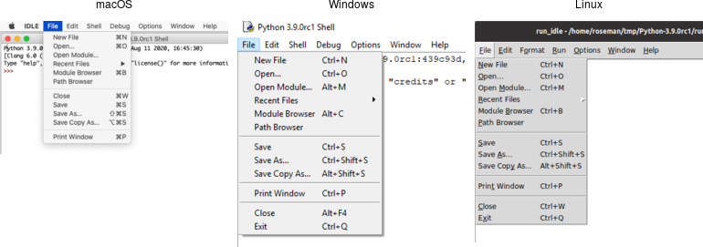

# Menubars

In this section, we'll look at menubars: how to create them, what goes in them,
how they're used, etc.

Properly designing a menubar and its set of menus is beyond the scope of this
tutorial. However, if you're creating an application for someone other than
yourself, here is a bit of advice. First, if you find yourself with many menus,
very long menus, or deeply nested menus, you may need to rethink how your user
interface is organized. Second, many people use the menus to explore what the
program can do, particularly when they're first learning it, so try to ensure
major features are accessible by the menus. Finally, for each platform you're
targeting, become familiar with how applications use menus, and consult the
platform's human interface guidelines for full details about design,
terminology, shortcuts, and much more. This is an area you will likely have to
customize for each platform.

|                Menubars                |
| :------------------------------------: |
|  |

> You'll notice on some recent Linux distributions that many applications show
their menus at the top of the screen when active, rather than in the window
itself. Tk does not yet support this style of menus.

## Menu Widgets and Hierarchy

Menus are implemented as widgets in Tk, just like buttons and entries. Each menu
widget consists of a number of different items in the menu. Items have various
attributes, such as the text to display for the item, a keyboard accelerator,
and a command to invoke.

Menus are arranged in a hierarchy. The menubar is itself a menu widget. It has
several items ("File," "Edit," etc.), each of which is a submenu containing more
items. These items can include things like the "Open..." command in a "File"
menu, but also separators between other items. It can even have items that open
up their own submenu (so-called cascading menus). As you'd expect from other
things you've seen already in Tk, anytime you have a submenu, it must be created
as a child of its parent menu.

Menus are part of the classic Tk widgets; there is not presently a menu in the
themed Tk widget set.Menus are implemented as widgets in Tk, just like buttons
and entries. Each menu widget consists of a number of different items in the
menu. Items have various attributes, such as the text to display for the item, a
keyboard accelerator, and a command to invoke.

Menus are arranged in a hierarchy. The menubar is itself a menu widget. It has
several items ("File," "Edit," etc.), each of which is a submenu containing more
items. These items can include things like the "Open..." command in a "File"
menu, but also separators between other items. It can even have items that open
up their own submenu (so-called cascading menus). As you'd expect from other
things you've seen already in Tk, anytime you have a submenu, it must be created
as a child of its parent menu.

Menus are part of the classic Tk widgets; there is not presently a menu in the
themed Tk widget set.

## Before you Start

It's essential to put the following line in your application somewhere before
you start creating menus.

```rust,no_run
tk.option_add( "*tearOff", 0 )?;
```

Without it, each of your menus (on Windows and X11) will start with what looks
like a dashed line and allows you to "tear off" the menu, so it appears in its
own window. You should eliminate tear-off menus from your application as they're
not a part of any modern user interface style.

> This is a throw-back to the Motif-style X11 that Tk's original look and feel
were based on. Get rid of them unless your application is designed to run only
on that old box collecting dust in the basement. We'll all look forward to a
future version of Tk where this misguided paean to backward compatibility is
removed.

> While on the topic of ancient history, the `option_add` bit uses the option
database. On X11 systems, this provided a standardized way to customize certain
elements of user interfaces through text-based configuration files.  It's no
longer used today. Older Tk programs may use the `option` command internally to
separate style configuration options from widget creation code.  This all
pre-dated themed Tk styles, which should be used for that purpose today.
However, it's somehow fitting to use the obsolete option database to
automatically remove the obsolete tear-off menus.

## Creating a Menubar

In Tk, menubars are associated with individual windows; each toplevel window can
have at most one menubar. On Windows and many X11 window managers, this is
visually obvious, as the menus are part of each window, sitting just below the
title bar at the top.

On macOS, though, there is a single menubar along the top of the screen, shared
by each window. As far as your Tk program is concerned, each window still does
have its own menubar. As you switch between windows, Tk ensures that the correct
menubar is displayed. If you don't specify a menubar for a particular window, Tk
will use the menubar associated with the root window; you'll have noticed by now
that this is automatically created for you when your Tk application starts.

> Because all windows have a menubar on macOS, it's important to define one,
either for each window or a fallback menubar for the root window. Otherwise,
you'll end up with the "built-in" menubar, which contains menus that are only
intended for typing commands directly into the interpreter.Because all windows
have a menubar on macOS, it's important to define one, either for each window or
a fallback menubar for the root window. Otherwise, you'll end up with the
"built-in" menubar, which contains menus that are only intended for typing
commands directly into the interpreter.

To create a menubar for a window, first, create a menu widget. Then, use the
window's `menu` configuration option to attach the menu widget to the window.

```rust,no_run
let win = root.add_toplevel(())?;
let menubar = win.add_menu(())?;
win.configure( -menu(menubar) )?;
```

> You can use the same menubar for more than one window. In other words, you can
specify the same menubar as the `menu` configuration option for several toplevel
windows. This is particularly useful on Windows and X11, where you may want a
window to include a menu, but don't necessarily need to juggle different menus
in your application. However, if the contents or state of menu items depends on
what's going on in the active window, you'll have to manage this yourself.

> This is truly ancient history, but menubars used to be implemented by creating
a frame widget containing the menu items and packing it into the top of the
window like any other widget. Hopefully, you don't have any code or
documentation that still does this.

## Adding Menus

We now have a menubar, but that's pretty useless without some menus to go in it.
So again, we'll create a menu widget for each menu, each one a child of the
menubar. We'll then add them all to the menubar.

```rust,no_run
let menu_file = menubar.add_menu(())?;
let menu_edit = menubar.add_menu(())?;
menubar.add_cascade( -menu(menu_file) -label("File") )?;
menubar.add_cascade( -menu(menu_edit) -label("Edit") )?;
```

> The `add_cascade` method adds a menu item, which itself is a menu (a submenu).

## Adding Menu Items

Now that we have a couple of menus in our menubar, we can add a few items to
each menu.

### Command Items

Regular menu items are called `command` items in Tk. We'll see some other types
of menu items shortly. Notice that menu items are part of the menu itself; we
don't have to create a separate menu widget for each one (submenus being the
exception).

```rust,no_run
menu_file.add_command( -label("New")     -command("newFile")   )?;
menu_file.add_command( -label("Open...") -command("openFile")  )?;
menu_file.add_command( -label("Close")   -command("closeFile") )?;
```

> On macOS, the ellipsis ("...") is actually a special character, more tightly
spaced than three periods in a row. Tk takes care of substituting this character
for you automatically.

Each menu item has associated with it several configuration options, analogous
to widget configuration options. Each type of menu item has a different set of
available options. Cascade menu items have a `menu` option used to specify the
submenu, command menu items have a `command` option to specify the command to
invoke when the item is chosen. Both have a `label` option to specify the text
to display for the item.

### Submenus

We've already seen `cascade` menu items used to add a menu to a menubar. Not
surprisingly, if you want to add a submenu to an existing menu, you also use a
`cascade` menu item in exactly the same way. You might use this to build a
"recent files" submenu, for example.

```rust,no_run
let menu_recent = menu_file.add_menu(())?;
menu_file.add_cascade( -menu(menu_recent) -label("Open Recent") )?;
for f in recent_files {
    let f = PathBuf::from(f);
    if let Some( file_name ) = f.file_name() {
        menu_recent.add_command(
            -label( file_name.to_str() )
            -command(( "openFile", f ))
        )?;
    }
}
```

### Separators

A third type of menu item is the `separator`, which produces the dividing line
you often see between different menu items.

```rust,no_run
menu_file.add_separator(())?;
```

### Checkbutton and Radiobutton Items

Finally, there are also `checkbutton` and `radiobutton` menu items that behave
analogously to checkbutton and radiobutton widgets. These menu items have a
variable associated with them. Depending on its value, an indicator (i.e.,
checkmark or selected radiobutton) may be shown next to its label.

```rust,no_run
menu_file.add_checkbutton( -label("Check") -variable("check") -onvalue(1) -offvalue(0) )?;
menu_file.add_radiobutton( -label("One")   -variable("radio") -value(1) )?;
menu_file.add_radiobutton( -label("Two")   -variable("radio") -value(2) )?;
```

When a user selects a checkbutton item that is not already checked, it sets the
associated variable to the value in `onvalue`. Selecting an item that is already
checked sets it to the value in `offvalue`. Selecting a radiobutton item sets
the associated variable to the value in `value`. Both types of items also react
to any changes you make to the associated variable.

Like command items, checkbutton and radiobutton menu items support a `command`
configuration option that is invoked when the menu item is chosen. The
associated variable and the menu item's state are updated before the callback is
invoked.

> Radiobutton menu items are not part of the Windows or macOS human interface
guidelines. On those platforms, the item's indicator is a checkmark, as it would
be for a checkbutton item. The semantics still work. It's a good way to select
between multiple items since it will show one of them selected (checked).

## Manipulating Menu Items

As well as adding items to the end of menus, you can also insert them in the
middle of menus via the `insert_{type}( index, opts )` method; here index is the
position (0..n-1) of the item you want to insert before. You can also delete one
or more menu items susing the `delete( index )` or `delete_range( index )`
methods.

```rust,no_run
menu_recent.delete_range( 0.. )?;
```

Like most everything in Tk, you can look at or change the value of an item's
options at any time. Items are referred to via an index. Usually, this is a
number (0..n-1) indicating the item's position in the menu. You can also specify
the label of the menu item (or, in fact, a "glob-style" pattern to match against
the item's label).

```rust,no_run
println!( "{}", menu_file.entrycget( 0, label )? ); // get label of top entry in menu
println!( "{}", menu_file.entryconfigure_options(0)? ); // show all options for an item
```

### State

You can disable a menu item so that users cannot select it. This can be done via
the `state` option, setting it to the value `disabled`. Use a value of `normal`
to re-enable the item.

Menus should always reflect the current state of your application. If a menu
item is not presently relevant (e.g., the "Copy" item is only applicable if
something in your application is selected), you should disable it. When your
application state changes so that the item is applicable, make sure to enable
it.

```rust,no_run
menu_file.entryconfigure( menu::Index::pattern("Close") -state("disabled") )?;
```

Sometimes you may have menu items whose name changes in response to application
state changes, rather than the menu item being disabled. For example, A web
browser might have a menu item that changes between "Show Bookmarks" and "Hide
Bookmarks" as a bookmarks pane is hidden or displayed.

```rust,no_run
bookmarks.entryconfigure( 3, -label("Hide Bookmarks") )?;
```

> As your program grows complex, it's easy to miss enabling or disabling some
items. One strategy is to centralize all the menu state changes in one routine.
Whenever there is a state change in your application, it should call this
routine. It will examine the current state and update menus accordingly. The
same code can also handle toolbars, status bars, or other user interface
components.

### Accelerator Keys

The `accelerator` option is used to indicate a keyboard equivalent that
corresponds to a menu item. This does not actually create the accelerator, but
only displays it next to the menu item. You still need to create an event
binding for the accelerator yourself.

> Remember that event bindings can be set on individual widgets, all widgets of
a certain type, the toplevel window containing the widget you're interested in,
or the application as a whole. As menu bars are associated with individual
windows, the event bindings you create will usually be on the toplevel window
the menu is associated with.

Accelerators are very platform-specific, not only in terms of which keys are
used for what operation, but what modifier keys are used for menu accelerators
(e.g., on macOS, it is the "Command" key, on Windows and X11, it is usually the
"Control" key). Examples of valid accelerator options are `Command-N`,
`Shift+Ctrl+X`, and `Command-Option-B`. Commonly used modifiers include
`Control`, `Ctrl`, `Option`, `Opt`, `Alt`, `Shift`, "`Command`, `Cmd`, and
`Meta`.

> On macOS, modifier names are automatically mapped to the different modifier
icons that appear in menus, i.e., `Shift` ⇒ ⇧, `Command` ⇒ ⌘, `Control` ⇒ ⌃, and
`Option` ⇒ ⌥.

```rust,no_run
edit.entryconfigure( menu::Index::pattern("Paste"), -accelerator("Command+V") )?;
```

### Underline

All platforms support keyboard traversal of the menubar via the arrow keys. On
Windows and X11, you can also use other keys to jump to particular menus or menu
items. The keys that trigger these jumps are indicated by an underlined letter
in the menu item's label. To add one of these to a menu item, use the
`underline` configuration option for the item. Its value should be the index of
the character you'd like underlined (from 0 to the length of the string - 1).
Unlike with accelerator keys, the menu will watch for the keystroke, so no
separate event binding is needed.

```rust,no_run
menubar.add_command( -label("Path Browser") -underline(5) )?; // underline "B"
```

### Images

It is also possible to use images in menu items, either beside the menu item's
label, or replacing it altogether. To do this, use the `image` and `compound`
options, which work just like in label widgets. The value for `image` must be a
Tk image object, while `compound` can have the values `bottom`, `center`,
`left`, `right`, `top`, or `none`.

## Menu Virtual Events

Platform conventions for menus suggest standard menus and items that should be
available in most applications. For example, most applications have an "Edit"
menu, with menu items for "Copy," "Paste," etc. Tk widgets like entry or text
will react appropriately when those menu items are chosen. But if you're
building your own menus, how do you make that work? What `command` would you
assign to a "Copy" menu item?

Tk handles this with virtual events. As you'll recall from the Tk Concepts
chapter, these are high-level application events, as opposed to low-level
operating system events. Tk's widgets will watch for specific events. When you
build your menus, you can generate those events rather than directly invoking a
callback function. Your application can create event bindings to watch for those
events too.

> Some developers create virtual events for every item in their menus. They
generate those events instead of calling routines in their own code directly.
It's one way of splitting off your user interface code from the rest of your
application. Remember that even if you do this, you'll still need code that
enables and disables menu items, adjusts their labels, etc. in response to
application state changes.

Here's a minimal example showing how we'd add two items to an "Edit" menu, the
standard "Paste" item, and an application-specific "Find..." item that will open
a dialog to find or search for something. We'll include an entry widget so that
we can check that "Paste" works.

```rust,no_run
let _e = root.add_ttk_entry(())?;
let m = root.add_menu(())?;
let m_edit = m.add_menu( "edit" )?;
m.add_cascade( -menu(m_edit) -label("Edit") )?;
m_edit.add_command( -label("Paste")
    -command( tkbind!( tk, || -> TkResult<()> {
        Ok( tk.focus()?.event_generate( event::virtual_event("Paste"), () )? )})))?;
m_edit.add_command( -label("Find...")
    -command( tkbind!( tk, || -> TkResult<()> {
        Ok( root.event_generate( event::virtual_event("OpenFindDialog"), () )? )})))?;
root.configure( -menu(m) )?;

root.bind( event::virtual_event("OpenFindDialog"), tkbind!( tk, || -> TkResult<String> {
    Ok( tk.message_box( -message("I hope you find what you're looking for!") )? )
}))?;
```

> When you generate a virtual event, you need to specify the widget that the
event should be sent to. We want the "Paste" event to be sent to the widget with
the keyboard focus (usually indicated by a focus ring). You can determine which
widget has the keyboard focus using the `focus` command. Try it out, choosing
the Paste item when the window is first opened (when there's no focus) and after
clicking on the entry (making it the focus). Notice the entry handles the
`event::virtual_event("Paste")` itself. There's no need for us to create an
event binding.

> The `event::virtual_event("OpenFindDialog")` event is sent to the root window,
which is where we create an event binding. If we had multiple toplevel windows,
we'd send it to a specific window.

Tk predefines the following virtual events:
  - `event::virtual_event("Clear")`
  - `event::virtual_event("Copy")`
  - `event::virtual_event("Cut")`
  - `event::virtual_event("Paste")`
  - `event::virtual_event("PasteSelection")`
  - `event::virtual_event("PrevWindow")`
  - `event::virtual_event("Redo")`
  - `event::virtual_event("Undo")`.

For additional information, see the `event` mod.

## Construct all menus in one statement

The tk crate provides `add_menus()`, a convenient API to construct all menus in
one place:

```rust,no_run
let win = root.add_toplevel(())?;
let created_widgets = win.add_menus( "menubar"
    -menu::cascade( "file" -label("File")
        -menu::command( -label("New")       -command("newFile") )
        -menu::command( -label("Open...")   -command("openFile") )
        -menu::command( -label("Close")     -command("closeFile") )
        -menu::cascade( "recent" -label("Open Recent") )
        -menu::separator( no_arg() )
        -menu::checkbutton( -label("Check") -variable("check") -onvalue(1) -offvalue(0) )
        -menu::radiobutton( -label("One")   -variable("radio") -value(1) )
        -menu::radiobutton( -label("Two")   -variable("radio") -value(2) )
    )
)?;
```

See `add_menus` example for more.

## Run Example

`cargo run --example menu`

`cargo run --example add_menus`
