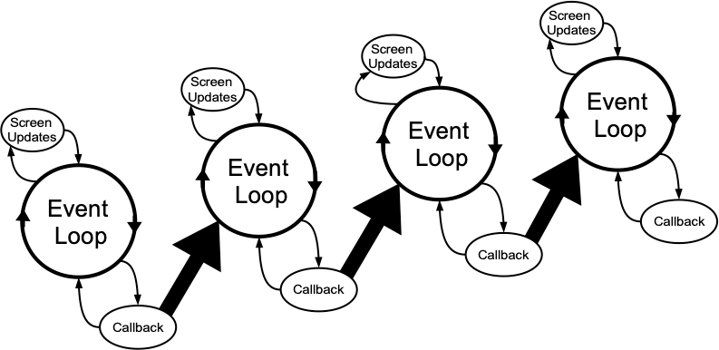

# Nested Event Processing

The previous three approaches are the correct ways to handle long-running
operations while still keeping you Tk GUI responsive. What they have in common
is a single event loop that continuously processes events of all kinds. That
event loop will call event handlers in your application code, which do their
thing and quickly return.

There is one other way. Within your long-running operation, you can invoke the
event loop to process a bunch of events. You can do this with a single command,
`update`. There's no messing around with timer events or asynchronous I/O.
Instead, you just sprinkle some `update` calls throughout your operation. If you
want to only keep the screen redrawing but not process other events, there's
even an option for that (`update_idletasks`).

This approach is seductively easy. And if you're lucky, it might work. At least
for a little while. But sooner or later, you're going to run into serious
difficulties trying to do things that way. Something won't be updating, event
handlers aren't getting called that should be, events are going missing or being
fired out of order, or worse. You'll turn your program's logic inside out and
tear your hair out trying to make it work again.

> When you use `update`, you're not returning control back to the running event
loop. You're effectively starting a new event loop nested within the existing
one. Remember, the event loop follows a single thread of execution: no threads,
no coroutines. If you're not careful, you're going to end up with event loops
called from within event loops called from... well, you get the idea. If you
even realize you're doing this, unwinding the event loops (each of which may
have different conditions to terminate it) will be an interesting exercise. The
reality won't match with your mental model of a simple event loop dispatching
events one at a time, independent of every other event. It's a classic example
of fighting against Tk's model. In very specific circumstances, it's possible to
make it work. In practice, you're asking for trouble. Don't say you haven't been
warned...

|     Nested event loops... this way madness lies      |
| :--------------------------------------------------: |
|  |
