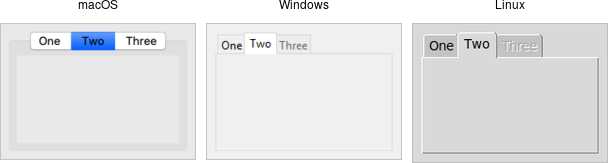

# Notebook

A *notebook* widget uses the metaphor of a tabbed notebook to let users switch
between one of several pages, using an index tab. Unlike with paned windows,
users only see a single page (akin to a pane) at a time.

|                 Notebook widgets                  |
| :-----------------------------------------------: |
|  |

Notebooks are created using the `add_ttk_notebook` method:

```rust,no_run
// cargo run --example notebook

use tk::*;
use tk::cmd::*;

fn main() -> TkResult<()> {
    let tk = make_tk!()?;
    let root = tk.root();

    let n = root.add_ttk_notebook(())?.pack(())?;
    let f1 = n.add_ttk_frame(())?; // first page, which would get widgets gridded into it 
    let f2 = n.add_ttk_frame(())?; // second page
    n.add( &f1, -text("One") )?;
    n.add( &f2, -text("Two") )?;

    Ok( main_loop() )
}
```

The operations on tabbed notebooks are similar to those on panedwindows. Each
page is typically a frame and again must be a direct child (subwindow) of the
notebook itself. A new page and its associated tab are added after the last tab
with the `add( subwindow, options )` method. The `text` tab option sets the
label on the tab; also useful is the `state` tab option, which can have the
value `normal`, `disabled` (not selectable), or `hidden`. 

To insert a tab at somewhere other than the end of the list, use the
`insert( &self, position, subwindow options )`, and to remove a given tab, use
the `forget` method, passing it either the position (0..n-1) or the tab's
subwindow. You can retrieve the list of all subwindows contained in the notebook
via the `tabs` method.

To retrieve the selected subwindow, call the `select` method, and change the
selected tab by passing it either the tab's position or the subwindow itself as
a parameter.

To change a tab option (like the text label on the tab or its state), you can
use the `tab( &self, tabid, options )` method (where `tabid` is again the tab's
position or subwindow); use `tabs( &self )` to return the current value of the
option.

Notebook widgets generate a `event::virtual_event( "NotebookTabChanged" )`
whenever a new tab is selected.

Again, there are a variety of less frequently used options and commands detailed
in the command reference.
