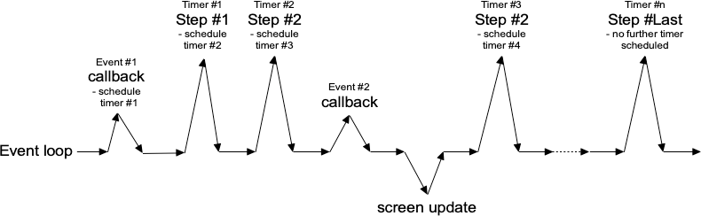

# One Step at a Time

If possible, the very best thing you can do is break your operation into very
small steps, each of which can execute very quickly. You let the event loop be
responsible for when the next step occurs. That way, the event loop continues to
run, processing regular events, updating the screen, and, in between all that,
calling your code to perform the next step of the operation.

To do this, we make use of timer events. Our program can ask the event loop to
generate one of these events at some time in the future. As part of its regular
work, when the event loop reaches that time, it will call back into our code to
handle the event. Our code would perform the next step of the operation. It then
schedules another timer event for the next step of the operation and immediately
returns control back to the event loop.

|                 Breaking up a large operation into small steps tied together with timer events                 |
| :------------------------------------------------------------------------------------------------------------: |
|  |

Tcl's `after` command can be used to generate timer events. You provide the
number of milliseconds to wait until the event should be fired. It may happen
later than that if Tk is busy processing other events but won't happen before
that. You can also ask that an `idle` event be generated; it will fire when no
other events in the queue need to be processed. (Tk's screen updates and redraws
occur in the context of idle events.) You can find more details on `after` in
the [reference manual](https://docs.rs/tcl/after/index.html).

In the following example, we'll perform a long operation that is broken up into
20 small steps. While this operation is being performed, we'll update a
progressbar, and also allow users to interrupt the operation.

In the following example, we'll perform a long operation that is broken up into
20 small steps. While this operation is being performed, we'll update a
progressbar, and also allow users to interrupt the operation.

```rust,no_run
// cargo run --example one_step_at_a_time

use std::os::raw::c_int;
use tcl::*;
use tk::*;
use tk::cmd::*;

fn main() -> TkResult<()> {
    let tk = make_tk!()?;
    let root = tk.root();

    let f = root.add_ttk_frame( "f" )?
        .grid(())?;
    let f_b = f.add_ttk_button( "b" -text("Start!") )?
        .grid( -column(1) -row(0) -padx(5) -pady(5) )?;
    let f_l = f.add_ttk_label( "l" -text("No Answer") )?
        .grid( -column(0) -row(0) -padx(5) -pady(5) )?;
    let f_p = f.add_ttk_progressbar( "p" -orient("horizontal") -mode("determinate") -maximum(20) )?
        .grid( -column(0) -row(1) -padx(5) -pady(5) )?;

    tclfn!( tk, fn stop() -> TkResult<()> {
        tcl_interp!().set( "interrupt", 1 );
        Ok(())
    });

    tclosure!( tk, cmd: "result", move |answer: String| -> TkResult<()> {
        f_p.configure( -value(0) )?;
        f_b.configure( -text("Start!") -command("start") )?;
        f_l.configure( -text({
            if answer.is_empty() {
                "No Answer".to_owned()
            } else {
                format!( "Answer: {}", answer )
            }
        }))?;
        Ok(())
    });

    tclosure!( tk, cmd: "step", move |count: c_int| ->TkResult<()> {
        let interp = tcl_interp!();

        f_p.configure( -value(count) )?;
        if interp.get_boolean("interrupt")? {
            interp.eval( "result {}" )?;
            return Ok(());
        }
        interp.after_ms( 100 )?; // next step in our operation; don't take too long!

        if count == 20 {
            interp.eval( "result 42" )?;
            return Ok(());  // done!
        }

        interp.after( 100, ( tclosure!( tk, move || -> TkResult<()> {
            tcl_interp!().eval(( "step", count+1 ))?;
            Ok(())
        }), ))?;

        Ok(())
    });

    f_b.configure( -command( tclosure!( tk, cmd:"start", move || -> TkResult<()> {
        f_b.configure( -text("Stop") -command("stop") )?;
        f_l.configure( -text("Working...") )?;
        let interp = tcl_interp!();
        interp.set( "interrupt", 0 );
        interp.set( "count", 1 );
        interp.after( 1, ( "step 0", ))?;
        Ok(())
    })))?;

    Ok( main_loop() )
}
```
