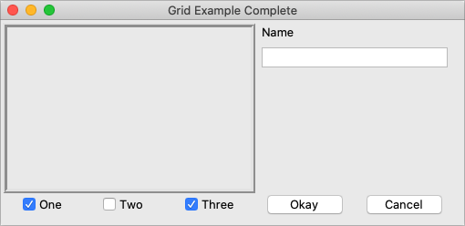

# Padding

Normally, each column or row will be directly adjacent to the next, so that
widgets will be right next to each other. This is sometimes what you want (think
of a listbox and its scrollbar), but often you want some space between widgets.
In Tk, this is called padding, and there are several ways you can choose to add
it.

We've already actually seen one way, and that is using a widget's own options to
add the extra space around it. Not all widgets have this, but one that does is a
frame; this is useful because frames are most often used as the master to grid
other widgets. The frame's `padding` option lets you specify a bit of extra
padding inside the frame, whether the same amount for each of the four sides or
even different for each.

A second way is using the `padx` and `pady` grid options when adding the widget.
As you'd expect, `padx` puts a bit of extra space to the left and right, while
`pady` adds extra space top and bottom. A single value for the option puts the
same padding on both left and right (or top and bottom), while a two-value list
lets you put different amounts on left and right (or top and bottom). Note that
this extra padding is within the grid cell containing the widget.

If you want to add padding around an entire row or column, the `columnconfigure`
and `rowconfigure` methods accept a `pad` option, which will do this for you.

Let's add the extra sticky, resizing, and padding behavior to our example
(additions in bold).

```rust,no_run
// cargo run --example padding

use tk::*;
use tk::cmd::*;

fn main() -> TkResult<()> {
    let tk = make_tk!()?;
    let root = tk.root();

    let c = root.add_ttk_frame( "c" -padding((3,3,12,12)) )?;
    c.add_ttk_frame( "f" -borderwidth(5) -relief("ridge") -width(200) -height(100) )?;
    c.add_ttk_label( "namelbl" -text("Name") )?;
    c.add_ttk_entry( "name" )?;
    c.add_ttk_checkbutton( "one"   -text("One")   -variable("one")   -onvalue(1) )?; tk.set( "one"  , 1 );
    c.add_ttk_checkbutton( "two"   -text("Two")   -variable("two")   -onvalue(1) )?; tk.set( "two"  , 0 );
    c.add_ttk_checkbutton( "three" -text("Three") -variable("three") -onvalue(1) )?; tk.set( "three", 1 );
    c.add_ttk_button( "ok" -text("Okay") )?;
    c.add_ttk_button( "cancel" -text("Cancel") )?;

    tk.grid( ".c"         -column(0) -row(0) -sticky("nsew") )?;
    tk.grid( ".c.f"       -column(0) -row(0) -columnspan(3) -rowspan(2) -sticky("nsew") )?;
    tk.grid( ".c.namelbl" -column(3) -row(0) -columnspan(2)             -sticky("nw")  -padx(5) )?;
    tk.grid( ".c.name"    -column(3) -row(1) -columnspan(2)             -sticky("new") -padx(5) -pady(5) )?;
    tk.grid( ".c.one"     -column(0) -row(3) )?;
    tk.grid( ".c.two"     -column(1) -row(3) )?;
    tk.grid( ".c.three"   -column(2) -row(3) )?;
    tk.grid( ".c.ok"      -column(3) -row(3) )?;
    tk.grid( ".c.cancel"  -column(4) -row(3) )?;

    root.grid_columnconfigure( 0, -weight(1) )?;
    root.grid_rowconfigure(    0, -weight(1) )?;
    c.grid_columnconfigure(    0, -weight(3) )?;
    c.grid_columnconfigure(    1, -weight(3) )?;
    c.grid_columnconfigure(    2, -weight(3) )?;
    c.grid_columnconfigure(    3, -weight(1) )?;
    c.grid_columnconfigure(    4, -weight(1) )?;
    c.grid_rowconfigure(       1, -weight(1) )?;

    Ok( main_loop() )
}
```

This looks more promising. Play around with the example to get a feel for the resize behavior.

Grid example, handling in-cell layout and resize.

|                Grid example, handling in-cell layout and resize                 |
| :-----------------------------------------------------------------------------: |
|  |
