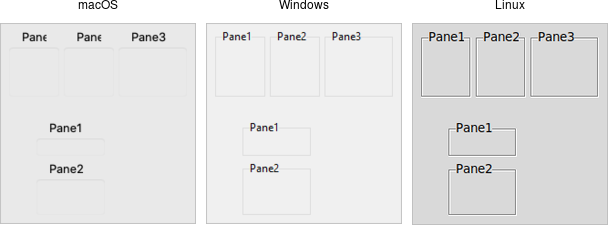

# Paned Windows

A *panedwindow* widget lets you stack two or more resizable widgets above and
below each other (or to the left and right). Users can adjust the relative
heights (or widths) of each pane by dragging a sash located between them.
Typically the widgets you're adding to a panedwindow will be frames containing
many other widgets.

| Panedwindow widgets(shown here managing several labelframes) |
| :----------------------------------------------------------: |
|       |

Panedwindows are created using the `add_ttk_panedwindow` method:

```rust,no_run
// cargo run --example paned_windows

use tk::*;
use tk::cmd::*;

fn main() -> TkResult<()> {
    let tk = make_tk!()?;
    let root = tk.root();

    let p = root.add_ttk_panedwindow( -orient("vertical") )?.pack(())?;

    // two panes, each of which would get widgets gridded into it:
    let f1 = p.add_ttk_labelframe( -text("Pane1") -width(100) -height(100) )?;
    let f2 = p.add_ttk_labelframe( -text("Pane2") -width(100) -height(100) )?;
    p.add( &f1, () )?;
    p.add( &f2, () )?;

    Ok( main_loop() )
}
```

A panedwindow is either `vertical` (its panes are stacked vertically on top of
each other) or horizontal. Importantly, each pane you add to the panedwindow
must be a direct child of the panedwindow itself.

Calling the `add` method adds a new pane at the end of the list of panes. The
`insert( position, subwindow, options )` method allows you to place the pane at
the given position in the list of panes (0..n-1). If the pane is already managed
by the panedwindow, it will be moved to the new position. You can use the
`forget( subwindow )` to remove a pane from the panedwindow (you can also pass a
position instead of a subwindow).

You can assign relative weights to each pane so that if the overall panedwindow
resizes, certain panes will be allocated more space than others. As well, you
can adjust the position of each sash between items in the panedwindow. See the
command reference for details.
