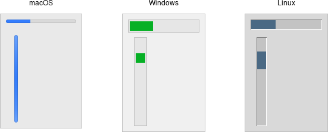

# Progressbar

A *progressbar* widget provides feedback to users about the progress of a
lengthy operation.

In situations where you can estimate how long the operation will take to
complete, you can display what fraction has already been completed. Otherwise,
you can indicate the operation is continuing, but without suggesting how much
longer it will take.

|                   Progressbar widgets                   |
| :-----------------------------------------------------: |
|  |

Progressbar widgets are created using the `addttk_progressbar` method:

```rust,no_run
parent.add_ttk_progressbar( -orient("horizontal") -length(200) -mode("determinate") )?;
```

As with scale widgets, they should be given an orientation (`horizontal` or
`vertical`) with the orient configuration option, and can be given an optional
`length`. The `mode` configuration option can be set to either `determinate`,
where the progressbar will indicate relative progress towards completion, or to
`indeterminate`, where it shows that the operation is still continuing but
without showing relative progress.

## Determinate Progress

To use determinate mode, estimate the total number of "steps" the operation will
take to complete. This could be an amount of time but doesn't need to be.
Provide this to the progressbar using the `maximum` configuration option. It
should be a floating-point number and defaults to `100.0` (i.e., each step is
1%).

As you proceed through the operation, tell the progressbar how far along you are
with the `value` configuration option. So this would start at 0, and then count
upwards to the maximum value you have set.

> There are two slight variations on this. First, you can just store the current
value for the progressbar in a variable linked to it by the progressbar's
`variable` configuration option; that way, when you change the variable, the
progressbar will update. The other alternative is to call the progressbar's
`step( amount )` method. This increments the value by the given amount.

## Indeterminate Progress

Use indeterminate mode when you can't easily estimate how far along in a
long-running task you actually are. However, you still want to provide feedback
that the operation is continuing (and that your program hasn't crashed). At the
start of the operation you'll just call the progressbar's `start` method. At the
end of the operation, call its `stop` method. The progressbar will take care of
the rest.

Unfortunately, "the progressbar will take care of the rest" isn't quite so
simple. In fact, if you `start` the progressbar, call a function that takes
several minutes to complete, and then `stop` the progressbar, your program will
appear frozen the whole time, with the progressbar not updating. In fact, it
will not likely appear onscreen at all. Yikes!

To learn why that is, and how to address it, the next chapter takes a deeper
dive into Tk's event loop.

## Run Example

`cargo run --example progressbar`
