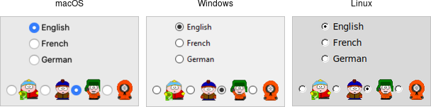

# Radiobutton

A *radiobutton* widget lets you choose between one of several mutually exclusive
choices. Unlike a checkbutton, they are not limited to just two options.
Radiobuttons are always used together in a set, where multiple radiobutton
widgets are tied to a single choice or preference. They are appropriate to use
when the number of options is relatively small, e.g., 3-5.

|                   Radiobutton widgets                   |
| :-----------------------------------------------------: |
|  |

Radiobuttons are created using the `add_ttk_radiobutton` method. Typically,
you'll create and initialize several of them at once:

```rust,no_run
parent.add_ttk_radiobutton( "home"   -text("Home")   -variable("phone") -value("home")   )?;
parent.add_ttk_radiobutton( "office" -text("Office") -variable("phone") -value("office") )?;
parent.add_ttk_radiobutton( "cell"   -text("Mobile") -variable("phone") -value("cell")   )?;
```

Radiobuttons share most of the same configuration options as checkbuttons. One
exception is that the `onvalue` and `offvalue` options are replaced with a
single `value` option. Each radiobutton in the set will have the same linked
variable, but a different value. When the variable holds the matching value,
that radiobutton will visually indicate it is selected. If it doesn't match, the
radiobutton will be unselected. If the linked variable doesn't exist, or you
don't specify one with the `variable` option, radiobuttons also display as
"tristate" or indeterminate. This can be checked via the `alternate` state flag.

## Run Example

`cargo run --example radiobutton`
