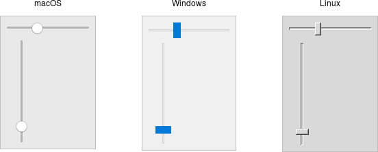

# Scale

A *scale* widget allows users to choose a numeric value through direct
manipulation.

|                Scale widgets                |
| :-----------------------------------------: |
|  |

Scale widgets are created using the `add_ttk_scale` method:

```rust
parent.add_ttk_scale( "s"
    -orient("horizontal") -length("200") -from("1.0") -to("100.0") )?;
```

The `orient` option may be either `horizontal` or `vertical`. The `length`
option, which represents the longer axis of either horizontal or vertical
scales, is specified in screen units (e.g., pixels). You should also define the
range of the number that the scale allows users to choose; to do this, set a
floating-point number for each of the `from` and `to` configuration options.

There are several different ways you can set the current value of the scale
(which must be a floating-point value between the `from` and `to` values). You
can set (or read, to get the current value) the scale's `value` configuration
option. You can link the scale to a variable using the `variable` option. Or,
you can call the scale's `set( value )` method to change the value, or the
`get()` method to read the current value.

A `command` configuration option lets you specify a script to call whenever the
scale is changed. Tk will append the current value of the scale as a parameter
each time it calls this script (we saw a similar thing with extra parameters
being added to scrollbar callbacks).

```rust,no_run
// cargo run --example scale

use std::os::raw::c_double;
use tcl::*;
use tk::*;
use tk::cmd::*;

fn main() -> TkResult<()> {
    let tk = make_tk!()?;
    let root = tk.root();

    // label tied to the same variable as the scale, so auto-updates
    root.add_ttk_label( "auto" -textvariable("num") )?
        .grid( -column(0) -row(0) -sticky("we") )?;
    
    // label that we'll manually update via the scale's command callback
    let manual = root.add_ttk_label( "manual" )?
        .grid( -column(0) -row(1) -sticky("we") )?;
    
    let scale =
        root.add_ttk_scale( "scale"
            -orient(   "horizontal" )
            -length(   "200"        )
            -from(     1.0          )
            -to(       100.0        )
            -variable( "num"        )
            -command(  tclosure!( tk, move |val: c_double| -> TkResult<()> {
                Ok( manual.configure( -text( format!( "Scale at {}", val )))? )
            }))
        )?
       .grid( -column(0) -row(2) -sticky("we") )?; 
    
    scale.set( 20.0 )?;

    Ok( main_loop() )
}
```

As with other themed widgets, you can use the `state( TkState::Disabled )`,
`state( !TkState::Disabled )`, and `instate( TkState::Disabled )` methods to
prevent users from modifying the scale.

> As the scale widget does not display the actual values, you may want to add
those separately, e.g., using label widgets.
