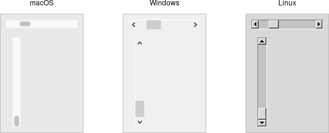
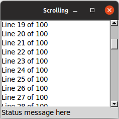

# Scrollbar

A *scrollbar* widget helps users see all parts of another widget, whose content
is typically much larger than what can be shown in the available screen space.

|                  Scrollbar widgets                  |
| :-------------------------------------------------: |
|  |

Scrollbars are created using the `add_ttk_scrollbar` method:

```rust,no_run
let s = parent
    .add_ttk_scrollbar( "s"
        -orient( "vertical" )
        -command( tkbind!( tk,
            move |..| -> TkResult<(c_double, c_double)> {
                Ok( l.yview()? )
            }
        ))
    )?;

l.configure( -yscrollcommand( tkbind!( tk,
    move |first:c_double, last:c_double| -> TkResult<()> {
        Ok( s.set( first, last )? )
    }
)))?;
```

Unlike in some user interface toolkits, Tk scrollbars are not a part of another
widget (e.g., a listbox), but are a separate widget altogether. Instead,
scrollbars communicate with the scrolled widget by calling methods on the
scrolled widget; as it turns out, the scrolled widget also needs to call methods
on the scrollbar. 

> If you're using a recent Linux distribution, you've probably noticed that the
scrollbars you see in many applications have changed to look more like what
you'd see on macOS. This newer look isn't supported on Linux by any of the
default themes included with Tk. However, some third-party themes do support it.

The `orient` configuration option determines whether the scrollbar will scroll
the scrolled widget in the `horizontal` or `vertical` dimension. You then need
to use the `command` configuration option to specify how to communicate with the
scrolled widget. This is the method to call on the scrolled widget when the
scrollbar moves.

Every widget that can be scrolled vertically includes a method named `yview`,
while those that can be scrolled horizontally have a method named `xview`). As
long as this method is present, the scrollbar doesn't need to know anything else
about the scrolled widget. When the scrollbar is manipulated, it appends several
parameters to the method call, indicating how it was scrolled, to what position,
etc.

The scrolled widget also needs to communicate back to the scrollbar, telling it
what percentage of the entire content area is now visible. Besides the `yview`
and/or `xview` methods, every scrollable widget also has a `yscrollcommand`
and/or `xscrollcommand` configuration option. This is used to specify a method
call, which must be the scrollbar's `set` method. Again, additional parameters
will be automatically tacked onto the method call.

> If, for some reason, you want to move the scrollbar to a particular position
from within your program, you can call the `set( first, last )` method yourself.
Pass it two floating-point values (between 0 and 1) indicating the start and end
percentage of the content area that is visible.

## Example

Listboxes are one of several types of widgets that are scrollable. Here, we'll
build a very simple user interface, consisting of a vertically scrollable
listbox that takes up the entire window, with just a status line at the bottom.

|                Scrolling a listbox                |
| :-----------------------------------------------: |
|  |

```rust,no_run
// cargo run --example scrollbar

use std::os::raw::c_double;

use tcl::*;
use tk::*;
use tk::cmd::*;

fn main() -> TkResult<()> {
    let tk = make_tk!()?;
    let root = tk.root();

    let l = root.add_listbox( "l" -height(5) )?
        .grid( -column(0) -row(0) -sticky("nwes") )?;

    let s = root.add_ttk_scrollbar( "s"
            -orient("vertical")
            -command( tkbind!( tk,
                |..| -> TkResult<()> { Ok( l.yview_( tcl_va_args!() )? )})))?
        .grid( -column(1) -row(0) -sticky("ns") )?;

    l.configure( -yscrollcommand( tkbind!( tk,
        |first:c_double, last:c_double| -> TkResult<()> { Ok( s.set( first, last )? )})))?;

    root.add_ttk_label( "stat" -text("Status message here") -anchor("w") )?
        .grid( -column(0) -columnspan(2) -row(1) -sticky("we") )?;

    root.grid_columnconfigure( 0, -weight(1) )?;
    root.grid_rowconfigure(    0, -weight(1) )?;

    for i in 0..100 {
       l.insert_end( Some( Obj::from( format!( "Line {} of 100", i ))))?;
    }

    Ok( main_loop() )
}
```

> If you've seen an earlier version of this tutorial, you might recall that at
this point we introduced a `sizegrip` widget. It placed a small handle at the
bottom right of the window, allowing users to resize the window by dragging the
handle. This was commonly seen on some platforms, including older versions of
macOS. Some older versions of Tk even automatically added this handle to the
window for you.

> Platform conventions tend to evolve faster than long-lived open source GUI
toolkits. Mac OS X 10.7 did away with the size grip in the corner, in favor of
allowing resizing from any window edge, finally catching up with the rest of the
world. Unless there's a pressing need to be visually compatible with 10+ year
old operating systems, if you have a `sizegrip` in your application, it's
probably best to remove it

## Run Example

`cargo run --example scrollbar`
