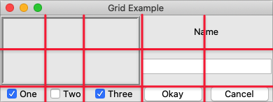

# Spanning Multiple Cells

Widgets can take up more than a single cell in the grid; to do this, we'll use
the `columnspan` and `rowspan` options when gridding the widget. These are
analogous to the "colspan" and "rowspan" attribute of HTML tables.

Here is an example of creating a user interface with multiple widgets, some that
take up more than a single cell.

|                 Gridding multiple widgets                |
| :------------------------------------------------------: |
|  |

```rust,no_run
/// cargo run --example spanning_multiple_cells

use tk::*;
use tk::cmd::*;

fn main() -> TkResult<()> {
    let tk = make_tk!()?;
    let root = tk.root();

    let c = root.add_ttk_frame( "c" )?;
    c.add_ttk_frame( "f" -borderwidth(5) -relief("ridge") -width(200) -height(100) )?;
    c.add_ttk_label( "namelbl" -text("Name") )?;
    c.add_ttk_entry( "name" )?;
    c.add_ttk_checkbutton( "one"   -text("One")   -variable("one")   -onvalue(1) )?; tk.set( "one"  , 1 );
    c.add_ttk_checkbutton( "two"   -text("Two")   -variable("two")   -onvalue(1) )?; tk.set( "two"  , 0 );
    c.add_ttk_checkbutton( "three" -text("Three") -variable("three") -onvalue(1) )?; tk.set( "three", 1 );
    c.add_ttk_button( "ok" -text("Okay") )?;
    c.add_ttk_button( "cancel" -text("Cancel") )?;

    tk.grid( ".c"         -column(0) -row(0) )?;
    tk.grid( ".c.f"       -column(0) -row(0) -columnspan(3) -rowspan(2) )?;
    tk.grid( ".c.namelbl" -column(3) -row(0) -columnspan(2) )?;
    tk.grid( ".c.name"    -column(3) -row(1) -columnspan(2) )?;
    tk.grid( ".c.one"     -column(0) -row(3) )?;
    tk.grid( ".c.two"     -column(1) -row(3) )?;
    tk.grid( ".c.three"   -column(2) -row(3) )?;
    tk.grid( ".c.ok"      -column(3) -row(3) )?;
    tk.grid( ".c.cancel"  -column(4) -row(3) )?;

    Ok( main_loop() )
}
```
