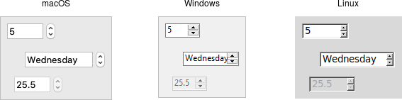

# Spinbox

A *spinbox* widget allows users to choose numbers (or, in fact, items from an
arbitrary list). It does this by combining an entry-like widget showing the
current value with a pair of small up/down arrows, which can be used to step
through the range of possible choices.

|                 Spinbox widgets                 |
| :---------------------------------------------: |
|  |

Spinbox widgets are created using the `add_ttk_spinbox` method:

```rust,no_run
parent.add_ttk_spinbox( "s" -from(1.0) -to(100.0) -textvariable("spinval") )?;
```

Like scale widgets, spinboxes let users choose a number between a certain range
(specified using the `from` and `to` configuration options), though through a
very different user interface. You can also specify an `increment`, which
controls how much the value changes every time you click the up or down button.

Like a listbox or combobox, spinboxes can also be used to let users choose an
item from an arbitrary list of strings; these can be specified using the
`values` configuration option. This works in the same way it does for
comboboxes; specifying a list of values will override to `from` and `to`
settings.

In their default state, spinboxes allow users to select values either via the up
and down buttons, or by typing them directly into the entry area that displays
the current value. If you'd like to disable the latter feature, so that only the
up and down buttons are available, you can set the `TtkState::ReadOnly` state
flag.

```rust,no_run
s.set_state( TtkState::ReadOnly )?;
```

Like other themed widgets, you can also disable spinboxes, via the
`TtkState::Disabled` state flag, or check the state via the `instate` method.
Spinboxes also support validation in the same manner as entry widgets, using the
`validate` and `validatecommand` configuration options.

> You might be puzzled about when to choose a scale, listbox, combobox, entry,
or a spinbox. Often, several of these can be used for the same types of data.
The answer really depends on what you want users to select, platform user
interface conventions, and the role the value plays in your user interface.

> For example, both a combobox and a spinbox take up fairly small amounts of
space compared with a listbox. They might make sense for a more peripheral
setting. A more primary and prominent choice in a user interface may warrant the
extra space a listbox occupies. Spinboxes don't make much sense when items don't
have a natural and obvious ordering to them. Be careful about putting too many
items in both comboboxes and spinboxes. This can make it more time consuming to
select an item.

There is a boolean `wrap` option that determines whether the value should wrap
around when it goes beyond the starting or ending values. You can also specify a
width for the entry holding the current value of the spinbox.

Again there are choices as to how to set or get the current value in the
spinbox. Normally, you would specify a linked variable with the `textvariable`
configuration option. As usual, any changes to the variable are reflected in the
spinbox, while any changes in the spinbox are reflected in the linked variable.
As well, the `set( value )` and `get()` methods allow you to set or get the
value directly.

Spinboxes generate virtual events when users press up
(`event::virtual_event("Increment")`) or down
(`event::virtual_event("Decrement")`). A `command` configuration option allows
you to provide a callback that is invoked on any changes.

## Run Example

`cargo run --example spinbox`
