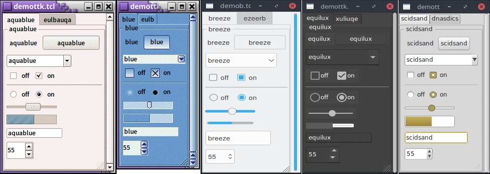

# Styles and Themes

The themed aspect of the modern Tk widgets is one of the most powerful and
exciting aspects of the newer widget set. Yet, it's also one of the most
confusing.

This chapter explains styles (which control how widgets like buttons look) and
themes (which are a collection of styles that define how all the widgets in your
application look). Changing themes can give your application an entirely
different look.

|    Applying different themes.   |
| :-----------------------------: |
|  |

Note that it's not just colors that have changed, but the actual shape of
individual widgets. Styles and themes are extremely flexible.

## Why?

However, before you get carried away, very few applications will benefit from
switching themes like this. Some games or educational programs might be
exceptions. Using the standard Tk theme for a given platform will display
widgets the way people expect to see them, particularly if they're running macOS
and Windows.

> On Linux systems, there's far less standardization of look and feel. Users
expect (and are more comfortable with) some variability and "coolness." Because
different widget sets (typically GTK and QT) are used by window managers,
control panels, and other system utilities, Tk can't seamlessly blend in with
the current settings on any particular system. Most of the Linux screenshots in
this tutorial use Tk's alt theme. Despite users being accustomed to variability,
there are limits to what most users will accept. A prime example is the styling
of core widgets in Tk's classic widget set, matching circa-1992 OSF/Motif.

Styles and themes, used in a more targeted manner and with significant
restraint, can have a role to play in modern applications. This chapter explains
why and when you might want to use them and how to go about doing so. We'll
begin by drawing a parallel between Tk's styles and themes and another realm of
software development.

## Understanding Styles and Themes

If you're familiar with web development, you know about cascading stylesheets
(CSS). There are two ways it can be used to customize the appearance of an
element in your HTML page. One way is to add a bunch of style attributes (fonts,
colors, borders, etc.) directly to an element in your HTML code via the `style`
attribute. For example:

```html
<label style="color:red; font-size:14pt; font-weight:bold; background-color:yellow;">
    Meltdown imminent!
</label>
```

The other way to use CSS is to attach a class to each widget via the `class`
attribute. The details of how elements of that class appear are provided
elsewhere, often in a separate CSS file. You can attach the same class to many
elements, and they will all have the same appearance. You don't need to repeat
the full details for every element. More importantly, you separate the logical
content of your site (HTML) from its appearance (CSS).

```html
<label class="danger">Meltdown imminent!</label>
...
<style type="text/css">
label.danger {color:red; font-size:14pt; font-weight:bold; background-color:yellow;}
</style>
```

Back to Tk.

* In the classic Tk widgets, all appearance customizations require specifying
  each detail on individual widgets, akin to always using the `style` HTML
  attribute.
* In the themed Tk widgets, all appearance customizations are made via attaching
  a style to a widget, akin to using the `class` HTML attribute. Separately, you
  define how widgets with that style will appear, akin to writing CSS.
* Unlike with HTML, you can't freely mix and match. You can't customize some
  themed entries or buttons with styles and others by directly changing
  appearance options.

> Yes, there are a few exceptions, like labels where you can customize the font
  and colors through both styles and configuration options.

## Benefits

So why use styles and themes in Tk? They take the fine-grained details of
appearance decisions away from individual instances of widgets.

That makes for cleaner code and less repetition. If you have 20 entry widgets in
your application, you don't need to repeat the exact appearance details every
time you create one (or write a wrapper function). Instead, you assign them a
style.

Styles also put all appearance decisions in one place. And because styles for a
button and styles for other widgets can share common elements, it promotes
consistency and improves reuse.

> Styles also have many benefits for widget authors. Widgets can delegate most
appearance decisions to styles. A widget author no longer has to hardcode logic
to the effect of "when the state is disabled, consult the 'disabledforeground'
configuration option and use that for the foreground color." Not only did that
make coding widgets longer (and more repetitive), but it also restricted how a
widget could be changed based on its state. If the widget author omitted logic
to change the font when the state changed, you were out of luck as an
application developer using the widget.

> Using styles, widget authors don't need to provide code for every possible
appearance option. That not only simplifies the widget but paradoxically ensures
that a wider range of appearances can be set, including those the widget author
may not have anticipated.

## Run Example

Example code in this chapter can be executed via:

`cargo run --example styles_and_themes`
