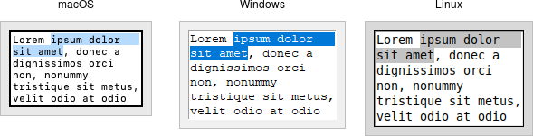

# Text

A *text* widget provides users with an area so that they can enter multiple
lines of text. Text widgets are part of the classic Tk widgets, not the themed
Tk widgets.

|               Text widgets                |
| :---------------------------------------: |
|  |

> Tk's text widget is, along with the canvas widget, one of two uber-powerful
widgets that provide amazingly deep but easily programmed features. Text widgets
have formed the basis for full word processors, outliners, web browsers, and
more. We'll get into some of the advanced stuff in a later chapter. Here, we'll
show you how to use the text widget to capture fairly simple, multi-line text
input.

Text widgets are created using the `add_tk_text` method:

```rust,no_run
parent.add_tk_text( "t" -width(40) -height(10) )?;
```

The `width` and `height` options specify the requested screen size of the text
widget, in characters and rows, respectively. The contents of the text can be
arbitrarily large. You can use the `wrap` configuration option to control how
line wrapping is handled: values are `none` (no wrapping, text may horizontally
scroll), char (wrap at any character), and `word` (wrapping will only occur at
word boundaries).

A text widget can be disabled so that no editing can occur. Because text is not
a themed widget, the usual `state` and `instate` methods are not available.
Instead, use the configuration option `state`, setting it to either `disabled`
or `normal`.

```rust,no_run
txt.configure( -state("disabled") )?;
```

Scrolling works the same way as in listboxes. The `xscrollcommand` and
`yscrollcommand` configuration options attach the text widget to horizontal
and/or vertical scrollbars, and the `xview` and `yview` methods are called from
scrollbars. To ensure that a given line is visible (i.e., not scrolled out of
view), you can use the `see( index )` method.

## Contents

Text widgets do not have a linked variable associated with them like, for
example, entry widgets do. To retrieve the contents of the entire text widget,
call the method `get( text::line_char(1,0).. )`; the `text::line_char(1,0)` is
an index into the text, and means the first character of the first line, and
`std::ops::RangeTo` is a shortcut for the index of the last character in the
last line. Other indices could be provided to retrieve smaller ranges of text if
needed.

Text can be added to the widget using the `insert( index, string )` method;
`index` marks the character before which text is inserted; use `Index::end()` to
add text to the end of the widget. You can delete a range of text using the
`delete( index )` or `delete( range )` method, where `range` is in the form of
`..`, `start..`, `start..=end`, `..=end`.

We'll get into the text widget's many additional advanced features in a later
chapter.

## Run Example

`cargo run --example text`
