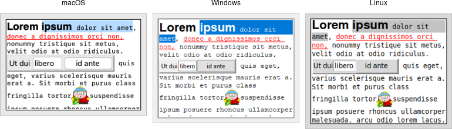

# Text

A *text* widget manages a multi-line text area. Like the canvas widget, Tk's
text widget is an immensely flexible and powerful tool that can be used for a
wide variety of tasks. It can provide a simple multi-line text area as part of a
form. But text widgets can also form the basis for a stylized code editor, an
outliner, a web browser, and much more.

Note: Text widgets are part of the classic Tk widgets, not the themed Tk
widgets.

|               Text widgets                |
| :---------------------------------------: |
|  |

While we briefly introduced text widgets in an earlier chapter, we'll go into
more detail here. You'll get a better sense of the level of sophistication they
allow. Still, if you plan to do any significant work with the text widget, the
reference manual is a well-organized, helpful, and highly-recommended read.

```rust,no_run
parent.add_tk_text( "t" -width(40) -height(10) )?;
```

You'll often provide a width (in characters) and height (in lines). As always,
you can ask the geometry manager to expand it to fill the available space in the
window.
