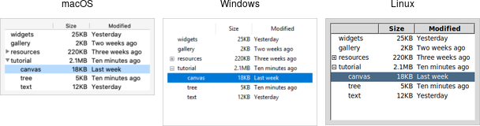

# Treeview

A *treeview* widget displays a hierarchy of items and allows users to browse
through it. One or more attributes of each item can be displayed as columns to
the right of the tree. It can be used to build user interfaces similar to the
tree display you'd find in file managers like the macOS Finder or Windows
Explorer. As with most Tk widgets, it offers incredible flexibility so it can be
customized to suit a wide range of situations.

|  |
| :---------------------------------------------: |
|                 Treeview widgets                |

Treeview widgets are created using the `add_ttk_treeview` command:

```rust,no_run
let tree = root.add_ttk_treeview(())?;
```

Horizontal and vertical scrollbars can be added in the usual manner if desired.
