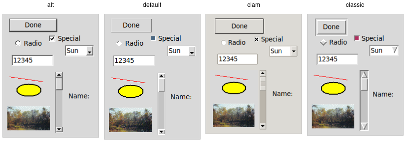

# Using Existing Themes

Before delving into the weightier matters of tastefully and selectively
modifying and applying styles to improve the usability of your application and
cleanliness of your code, let's deal with the fun bits: using existing themes to
completely reskin your application.

Themes are identified by a name. You can obtain the names of all available
themes:

```rust,no_run
let names = tk.theme_names()?
    .iter()
    .fold( String::new(), |acc,name| format!( "{} {}", acc, name ));
println!( "{}", names ); // clam alt default classic
```

|  |
| :------------------------------------------------: |
|                  Built-in themes.                  |

Besides the built-in themes (`alt`, `default`, `clam`, and `classic`), macOS
includes a theme named `aqua` to match the system-wide style, while Windows
includes themes named `vista`, `winxpnative`, and `winnative`.

Only one theme can be active at a time. To obtain the name of the theme
currently in use, use the following:

```rust,no_run
let theme = tk.theme_in_use()?;
println!( "{}", theme.name ); // aqua
```

> This API, which was originally targeted for Tk 8.6, was back-ported to Tk
8.5.9. If you're using an earlier version of Tk getting this info is a bit trickier.

Switching to a new theme can be done with:

```rust,no_run
new_theme.theme_use()?;
```

What does this actually do? Obviously, it sets the current theme to the
indicated theme. Doing this, therefore, replaces all the currently available
styles with the set of styles defined by the theme. Finally, it refreshes all
widgets, so they take on the appearance described by the new theme.

## Third-Party Themes

With a bit of looking around, you can find some existing add-on themes available
for download. A good starting point is
[https://wiki.tcl-lang.org/page/List+of+ttk+Themes]().

Though themes can be defined in any language that Tk supports, most that you
will find are written in Tcl. How can you install them so that they are
available to use in your application?

As an example, let's use the "awdark" theme, available from
[https://sourceforge.net/projects/tcl-awthemes/](). Download and unzip the
awthemes-*.zip file somewhere. You'll notice it contains a bunch of .tcl files,
a subdirectory i containing more directory with images used by the theme, etc.

One of the files is named `pkgIndex.tcl`. This identifies it as a Tcl package,
which is similar to a module in other languages. If we look inside, you'll see a
bunch of lines like `package ifneeded awdark 7.7`. Here, `awdark` is the name of
the package, and `7.7` is its version number. It's not unusual, as in this case,
for a single `pkgIndex.tcl` file to provide several packages.

To use it, we need to tell Tcl where to find the package (via adding its
directory to Tcl's `auto_path`) and the name of the package to use.

```rust,no_run
let path = std::path::Path::new( "/full/path/to/awthemes-9.3.1" );
tk.package_load( "awdark", path )?;
```

If the theme is instead implemented as a single Tcl source file, without a
`pkgIndex.tcl`, you can make it available like this:

```rust,no_run
let path = std::path::Path::new( "/full/path/to/themefile.tcl" );
tk.source( path )?;
```

You should now be able to use the theme in your own application, just as you
would a built-in theme.
