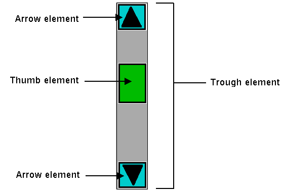

# What's Inside a Style?

If all you want to do is use a style or create a new one with a few tweaks, you
now know everything you need. If, however, you want to make more substantial
changes, things start to get "interesting."

## Elements

While each style controls a single type of widget, each widget is usually
composed of smaller pieces, called elements. It's the job of the style author to
construct the entire widget out of these smaller elements. What these elements
are depends on the widget.

Here's an example of a button. It might have a border on the very outside.
That's one element. Just inside that, there may be a focus ring. Normally, it's
just the background color, but could be highlighted when a user tabs into the
button. So that's a second element. Then there might be some spacing between
that focus ring and the button's label. That spacing is a third element.
Finally, the text label of the button itself is a forth element. 

|  |
| :-------------------------------------------------------------: |
|                  Possible elements of a button.                 |

Why might the style author have divided it up that way? If you have one part of
the widget that may be in a different location or a different color than
another, it may be a good candidate for an element. Note that this is just one
example of how a button could be constructed from elements. Different styles and
themes could (and do) accomplish this in different ways.

Here is an example of a vertical scrollbar. It consists of a "trough" element,
which contains other elements. These include the up and down arrow elements at
either end and a "thumb" element in the middle (it might have additional
elements, like borders).

|  |
| :-------------------------------------------------------------------: |
|                   Possible elements of a scrollbar.                   |

## Layout

Besides specifying which elements make up a widget, a style also defines how
those elements are arranged within the widget. This is called their layout. Our
button had a label element inside a spacing element, inside a focus ring
element, inside a border element. Its logical layout is this:

```
border {
    focus {
        spacing {
            label
        }
    }
}
```

We can ask Tk for the layout of the `TButton` style:

```rust,no_run
println!( "{}", tbutton_style.layout()? );
// "Button.border -sticky nswe -border 1 -children {Button.focus -sticky nswe -children {Button.spacing -sticky nswe -children {Button.label -sticky nswe}}}"
```

If we clean this up and format it a bit, we get something with this structure:

```
Button.border -sticky nswe -border 1 -children {
    Button.focus -sticky nswe -children {
        Button.spacing -sticky nswe -children {
            Button.label -sticky nswe
        }
    }
}
```

This starts to make sense; we have four elements, named `Button.border`,
`Button.focus`, `Button.spacing`, and `Button.label`. Each has different element
options, such as `children`, `sticky`, and `border` that specify layout or
sizes. Without getting into too much detail at this point, we can clearly see
the nested layout based on the `children` and `sticky` attributes.

> Styles uses a simplified version of Tk's `pack` geometry manager to specify
element layout. This is detailed in the
[style](https://tcl.tk/man/tcl8.6/TkCmd/ttk_style.htm) reference manual page.

## Element Options

Each of these elements has several different options. For example, a label
element has a font and a foreground color. An element representing the thumb of
a scrollbar may have one option to set its background color and another to
provide the width of a border. These can be customized to adjust how the
elements within the overall widget look.

You can determine what options are available for each element? Here's an example
of checking what options are available for the label inside the button (which we
know from the `layout` method is identified as `Button.label`):

```rust,no_run
let options = tk
    .element("Button.label")
    .element_options()?
    .iter()
    .fold( String::new(), |acc,opt| format!( "{} {}", acc, opt ));
println!( "{}", options ); // " -compound -space -text -font -foreground -underline -width -anchor -justify -wraplength -embossed -image -stipple -background"
```

In the following sections, we'll look at the not-entirely-straightforward way to
work with element options.
