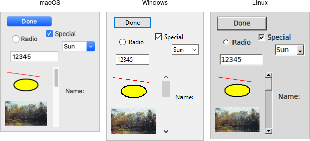
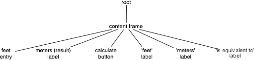
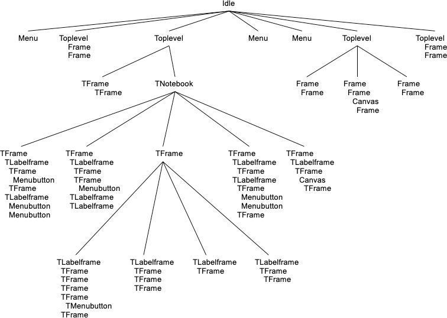

# Widgets

Widgets are all the things that you see onscreen. In our example, we had a
button, an entry, a few labels, and a frame. Others are things like checkboxes,
tree views, scrollbars, text areas, and so on. Widgets are often referred to as
"controls." You'll also sometimes see them referred to as "windows,"
particularly in Tk's documentation. This is a holdover from its X11 roots (under
that terminology, both your toplevel application window and things like a button
would be called windows).

Here is an example showing some of Tk's widgets, which we'll cover individually
shortly.

|                 Several Tk Widgets                 |
| :------------------------------------------------: |
|  |

## Widget Classes

Widgets are objects, instances of classes that represent buttons, frames, and so
on. When you want to create a widget, the first thing you'll need to do is
identify the specific class of the widget you'd like to instantiate. This
tutorial and the widget roundup will help with that.

## Widget Hierarchy

Besides the widget class, you'll need one other piece of information to create
it: its parent. Widgets don't float off in space. Instead, they're contained
within something else, like a window. In Tk, all widgets are part of a widget
(or window) hierarchy, with a single root at the top of the hierarchy.

In our metric conversion example, we had a single frame that was created as a
child of the root window, and that frame had all the other controls as children.
The root window was a container for the frame and was, therefore, the frame's
parent. The complete hierarchy for the example looked like this:

| The widget hierarchy of the metric conversion example |
| :---------------------------------------------------: |
|               |

This hierarchy can be arbitrarily deep, so you might have a button in a frame in
another frame within the root window. Even a new window in your application
(often called a toplevel) is part of that same hierarchy. That window and all
its contents form a subtree of the overall widget hierarchy.

| Hierarchy of a more substantial application. Leaf nodes (buttons, labels, etc.) omitted |
| :-------------------------------------------------------------------------------------: |
|                                            |

## Creating Widgets, Step By Step

Each separate widget is a Rust struct instance. When instantiating a widget, you
must call corresponding `.add_xxx()` method of its parent. Each widget is either
given an explicit pathname, or assigned an auto-generated one, which both
differentiates it from other widgets, and also indicates its place in the window
hierarchy.

The root of the hierarchy, the toplevel widget that Tk automatically creates, is
named simply . (dot) and will contain everything else. That is automatically
created when you instantiate Tk. It does not have a parent. For example:

```rust,no_run
// cargo run --example creating_widgets_step_by_step

use tk::*;
use tk::cmd::*;

fn main() -> TkResult<()> {
    let tk = make_tk!()?;
    let root = tk.root();
    let content = root
        .add_frame(())? // auto-generated name
        .pack(())?; // make visible
    let _label = content
        .add_label( "lbl" -text("step by step") )? // named "lbl"
        .pack(())?; // make visible
    let _button = content
        .add_button( "btn" -text("quit") -command("destroy .") )? // named "btn"
        .pack(())?; // make visible
    Ok( main_loop() )
}
```

Whether or not you save the widget object in a variable is entirely up to you,
depending on whether you'll need to refer to it later.

## Creating Widgets, In One Expression With Geometry

The hierarchy of widget trees, including geometry managers, can be encoded in
one single expression as the argument of `tk::Widget::add_widgets()`.

```rust,no_run
// cargo run --example creating_widgets_in_one_expression_with_geometry

use tk::*;
use tk::cmd::*;

fn main() -> TkResult<()> {
    let tk = make_tk!()?;
    tk.root().add_widgets(
        -pack( -label( -text("all in one") ))
        -pack( -frame( -pack( -button( "btn" -text("quit") -command("destroy .") ))))
    )?;
    Ok( main_loop() )
}
```

## Creating Widgets, In One Expression Without Geometry

Similar with the "All In One" style, except that the geometry managers are
defined separatedly.

```rust,no_run
// cargo run --example creating_widgets_in_one_expression_without_geometry

use tk::*;
use tk::cmd::*;

fn main() -> TkResult<()> {
    let tk = make_tk!()?;
    tk.root().add_widgets(
        -label( "lbl" -text("geometry managers separated") )
        -frame( "fr" -button( "btn" -text("quit") -command("destroy .") ))
    )?;
    tk.pack( ".lbl .fr .fr.btn" )?;
    Ok( main_loop() )
}
```

## Configuration Options

All widgets have several configuration options. These control how the widget is
displayed or how it behaves.

The available options for a widget depend upon the widget class, of course.
There is a lot of consistency between different widget classes, so options that
do pretty much the same thing tend to be named the same. For example, both a
button and a label have a text option to adjust the text that the widget
displays, while a scrollbar would not have a text option since it's not needed.
Similarly, the button has a command option telling it what to do when pushed,
while a label, which holds just static text, does not.

Configuration options can be set when the widget is first created by specifying
their names and values as optional parameters. Later, you can retrieve the
current values of those options, and with a very small number of exceptions,
change them at any time.

This is all best illustrated with the following interactive dialog.

```rust,no_run
// cargo run --example configuration_options

use tk::*;
use tk::cmd::*;

fn main() -> TkResult<()> {
    let tk = make_tk!()?;
    let root = tk.root();

    // create a button, passing two options:
    let b = root.add_ttk_button( "b" -text("Hello") -command("button_pressed") )?.grid(())?;

    // check the current value of the text option:
    assert_eq!( b.cget( text )?.to_string(), "Hello" );

    // check the current value of the command option:
    assert_eq!( b.cget( command )?.to_string(), "button_pressed" );

    // change the value of the text option:
    b.configure( -text("Goodbye") )?;

    // check the current value of the text option:
    assert_eq!( b.cget( text )?.to_string(), "Goodbye" );

    Ok( main_loop() )
}
```

## Widget Introspection

Tk exposes a treasure trove of information about each and every widget that your
application can take advantage of. Much of it is available via the winfo
facility; see the winfo command reference for full details.

This short example traverses the widget hierarchy, using each widget's
`winfo_children` method to identify any child widgets that need to examined. For
each widget, we print some basic information, including it's class (button,
frame, etc.), it's width and height, and it's position relative to it's parent.

```rust,no_run
// cargo run --example widget_introspection

use tk::*;
use tk::cmd::*;

fn print_hierarchy<TK:TkInstance>( w: &Widget<TK>, depth: usize ) -> TkResult<()> {
    println!( "{}{} w={} h={} x={} y={}"
        , str::repeat( " ", depth )
        , w.winfo_class()?
        , w.winfo_width()?
        , w.winfo_height()?
        , w.winfo_x()?
        , w.winfo_y()?
    );
    for child in w.winfo_children()? {
        print_hierarchy( &child, depth+1 )?;
    }

    Ok(())
}

fn main() -> TkResult<()> {
    let tk = make_tk!()?;
    tk.root().add_widgets(
        -pack( -label( -text("all in one") ))
        -pack( -frame( -pack( -button( "btn" -text("quit") -command("destroy .") ))))
    )?;

    print_hierarchy( &tk.root(), 0 )?;

    Ok(())
}
```

The following are some of the most useful methods:

| Method            | Functionality |
| :---------------- | :------------ |
| `winfo_class`     | a class identifying the type of widget, e.g. TButton for a themed button |
| `winfo_children`  | a list of widgets that are the direct children of a widget in the hierarchy |
| `winfo_parent`    | parent of the widget in the hierarchy |
| `winfo_toplevel`  | the toplevel window containing this widget |
| `winfo_width`     | current width of the widget; not accurate until appears onscreen |
| `winfo_height`    | current height of the widget; not accurate until appears onscreen |
| `winfo_reqwidth`  | the width the widget requests of the geometry manager (more on this shortly) |
| `winfo_reqheight` | the height the widget requests of the geometry manager (more on this shortly) |
| `winfo_x`         | the x position of the top-left corner of the widget relative to its parent |
| `winfo_y`         | the y position of the top-left corner of the widget relative to its parent |
| `winfo_rootx`     | the x position of the top-left corner of the widget relative to the entire screen |
| `winfo_rooty`     | the y position of the top-left corner of the widget relative to the entire screen |
| `winfo_vieweable` | whether the widget is displayed or hidden (all its ancestors in the hierarchy must be viewable for it to be viewable) |
